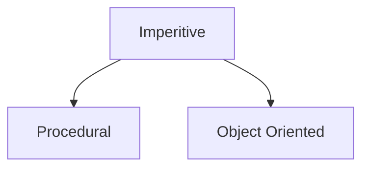
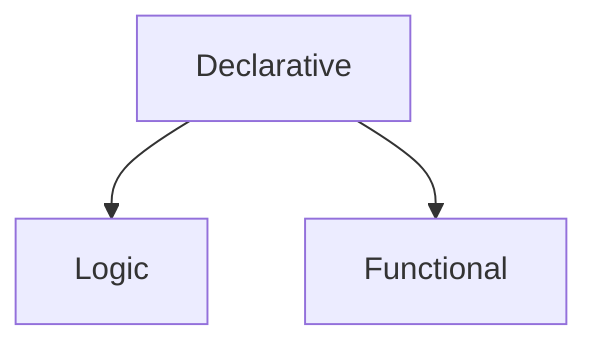

**Programming paradigm refers to a style of programming.** Programming languages need to follow some strategy when they are implemented known as a paradigm.

There are two significant paradigms programming languages fall into - **Imperative** and **Declarative**. These categories have various subtypes:





## Imperative

The word “imperative” comes from the Latin “impero” meaning “I command”. This is the oldest programming paradigm. It effectively means the code is a series of commands executed in order to achieve a result.

Imperative tells a program exactly how to do something. For example, if we need a program to print numbers in an array that are less than 10:

```Javascript
    const nums = [5, 10, 15, 8, 7]
    let lessThanTen = []

    for(i = 0; i < nums.length; i++) {
        if(nums[i] < 10) {
            lessThanTen.push(nums[i]);
        }
    }

    // prints [5, 8, 7]
    console.log(lessThanTen)
```

## Declarative

Declarative programming focuses on the end result as opposed to how to get there. For example, if we need a program to print numbers in an array that are less than 10:

```Javascript
    const nums = [5, 10, 15, 8, 7]
    // prints [5, 8, 7]
    console.log(nums.filter(num => num < 10))
```

React is a declarative framework as rather than telling it how to render (in the same way you do with vanilla JS), you tell it what you want it to render.

## Types of Imperative Programming

### Procedural Programming

Built around the idea that programs are sequences of instructions to be executed - splits up programs into 'procedures' or functions. This is effectively the same as imperative with the idea of using code splitting and enhancing reusability with subroutines.

```Javascript
    // use a function (procedural)
    function getNumbersLessThanTen(nums) {
        let lessThanTen = []
        for(i = 0; i < nums.length; i++) {
            if(nums[i] < 10) {
                lessThanTen.push(nums[i]);
            }
        }
        return lessThanTen

    }


    // prints [5, 8, 7]
    console.log(getNumbersLessThanTen([5, 10, 15, 8, 7]))
```

### Object-oriented Programming

OOP was introduced in order to overcome procedural programming limitations. In OOP, code is organised into objects and classes. In conventional procedural programming, data was global and there was a difficulty in securing the program from unintended changes. OOP controls access to data via encapsulation within classes.

The main priniciples of OOP are:

1. Encapsulation
2. Inheritance
3. Abstraction
4. Polymorphism

## Types of Declarative Programming

### Logical programming

Made up of facts and rules and foundationally mathematical. It takes a declarative approach to problem solving by using everything it knows and trying to answer whether the given facts and clauses are true. For example, if the code states that A is equal to B and B is equal to C, a logical program will make the logical conclusion that A must be equal to C.

Examples of languages that use logic programming paradigm are Prolog, Absys or Alice.

### Functional programming

Functional programming is language independent. FP is the process of building software by composing pure functions, avoiding shared state, mutable data and side effects. JavaScript is a notable example of a language that fundemnatally supports the functional paradigm.

A pure function is one which, given the same inputs, always returns the same output and has no side effects. This is an important aspect of functional programming. The idea is that functions are not dependent on local or global state.

Functions are described as "first class objects" in functional programming. The reason is that functions can be assigned to variables, passed as arguments, and returned from other functions, just as any other data type can.

```JavaScript

// assign function to variable!
let log = function(someVariable) {
    console.log(someVariable);
    return someVariable;
}


let myVar = "Hello world";

log(myVar);
// Hello world
```
