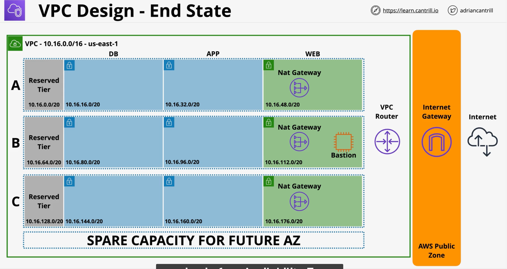
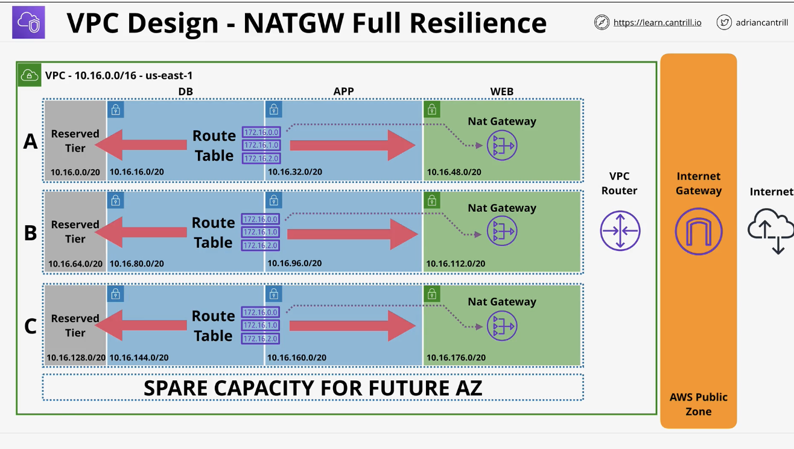
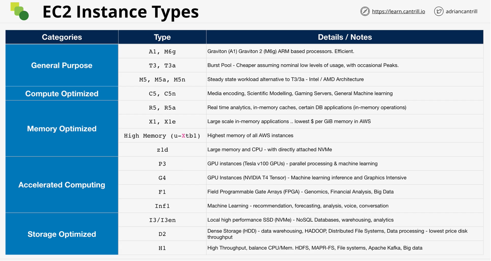
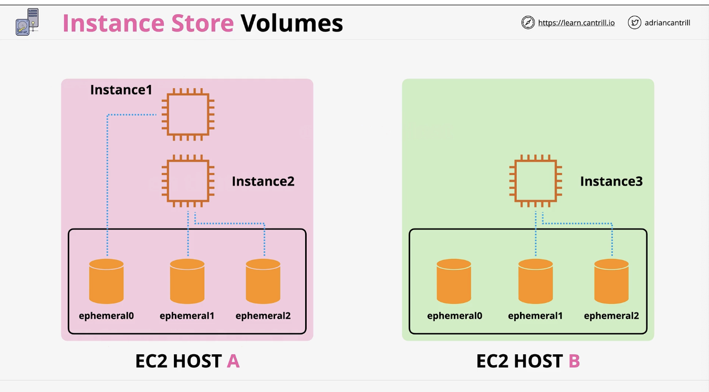
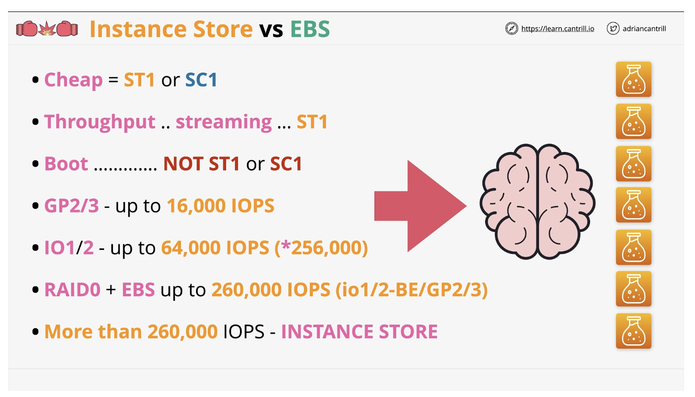
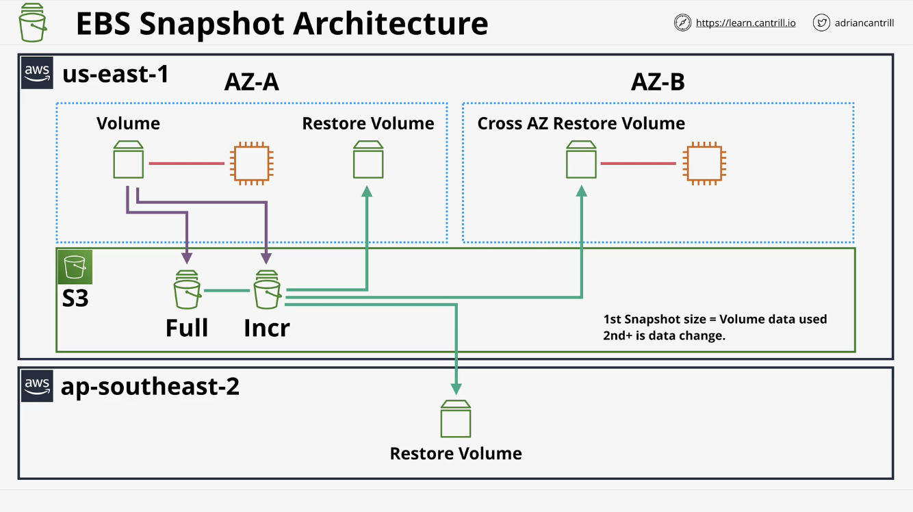

Notes attributed to [this course](https://learn.cantrill.io/courses/enrolled/1820301)

## AWS Accounts

- An AWS account is a container for identities (users) and resources
- Every AWS account has a root user
- The account root user can't be restricted it has full access to everything within this account.
- The credit card used with the root account will be the **Account** Payment method, everything will be billed to that card
- AWS is a pay-as-you-go/consume platform
- Certain resources have a free-tier
- IAM - every AWS account comes with it's own IAM Database
- IAM lets you create 3 different IAM profiles - Users, groups and roles
  - Users represent humans or applications that need access to your account - this is for individual purposes
  - Groups are a collection of related users
  - Roles can be used for granting external access to your account
- IAM policy - used to allow/deny access to AWS services attached to other identities
- IAM is an identity provider, which also authenticates and authorizes
- IAM Access Keys are long term credentials with up to 2 available per IAM user typically used in CLIs or applications
- Access Keys are made up of Access Key ID and the Secret Access Key

## Technical fundamentals

Pre-cursor to the concepts covered in this course summarized here:
[[architecture.tech-fundamentals]]

## AWS Fundamentals

### Public vs Private services

- Services can be categorized into two types: public and private services
- AWS public and private service are separated by network access.
- Public service is something which can be accessed using public endpoints e.g. s3
- A private aws service runs within a vpc so only what is connected to that vpc can access it
- AWS has three zones - the public internet zone, the private network and the AWS public zone which runs in between the public and private zone.
- AWS public zone is where public services operate from e.g. s3

### AWS Global Infrastructure

- AWS have created their infrastructure platform consisting of isolated regions connected together.
- A region is a creation of AWS which covers an area over the world which contains a full deployment of AWS infrastructure. New regions are added all the time.
- When interacting with most AWS services you're doing it at a particular region e.g. elastic compute cloud in North virginia is different to interacting to elastic compute in Sydney.
- AWS also provides Edge locations which are smaller than regions and they typically have only content distribution services as well as some types of edge computing. They are useful for companies like Netflix who want to store tv shows and movies as close to their customers as possible to allow low for low latency and high speed distribution
- Some services act from a global perspective e.g. IAM
- Regions have three main benefits:

1. Each reason is separate geographically which isolates any faults
2. Geopolitical separation - different governance depending the region
3. Location control - tune architecture performance relative to an area

- Regions also have a code e.g. Sydney is ep-southeast-2, as well as a name - Asia Pacific (Sydney)

Inside every region, AWS also provide multiple availability zones. These give isolated infrastructure within a region. If a region experiences an isolated issue but only one availability zone is affected, the others are likely to be still fully functional. A solutions architect may distribute the services across multiple availability zones. This is used to build resilience.

### AWS Default Virtual Private Cloud (VPC)

- A VPC is a Virtual Network inside AWS
- A VPC is a regional service that operates within that region
- A VPC by default is private and isolated. Services deployed into the same vpc can communicate but it's isolated from other vpcs and the AWS zone/public internet.
- There are two types of VPCs per account:

1. Default VPCs - can only have one per region. Configured by AWS.
2. Custom VPCs - can have many per region. You use these in almost all serious AWS deployments to configure them how you like.

- VPCs cannot communicate with each other without you configuring them to do so.
- VPCs are regionally resilient
- The default VPC gets a default CIDR IP range which is always the same - 172.31.0.0/16
- A VPC can be subdivided into subnets for resilience. Each subnet inside a VPC can be put into an availability zone. The default VPC has one subnet in every availability zone in that region.
- the default VPC assigns a public address to the services by default.

### Elastic Compute Cloud (EC2)

- EC2 is a service which allows you to provision virtual machines known as instances with an operating system.
- EC2 is IAAS (Infrastructure as a Service) which provides access to virtual machines (instances)
- An instance is just an operating system configured in a certain way
- EC2 is a private AWS service by default - it uses VPC. You can configure it to have public access
- An EC2 is AZ (availability zone) resilient. If the AZ fails then the instance fails
- You can choose an instance with various sizes and capabilities
- EC2 provides on-demand billing - per second
- Instances can use different types of storage e.g. local host storage (ec2 host) or Elastic Block Store (EBS) which is network storage made available
- EC2 instances have a state e.g. RUNNING -> STOPPED -> TERMINATED
- EC2 can be moved from RUNNING TO STOPPED and back again
- TERMINATING an instance is a one way change, you can do that from the RUNNING or STOPPED state. It's a non-reversible action
- At a high level, an instance is composed of CPU, memory, disk and networking. You are charged for all four of those instances.
- When an instance is STOPPED, it means no CPU, memory or network is being used therefore you won't be charged for any running costs of that instance. Storage however is still being used when it's in the stopped state which means you will be charged for it.
- In order to have no costs for an EC2 instance you need to terminate it.
- An Amazon Machine Image (AMI) is an image of an EC2 instance.
- An AMI can be used to create an EC2 instance or an AMI can be created from an EC2 instance.
- An AMI is similar to a server image in a physical server
- An AMI contains:
  - Attached permissions - who can use the image e.g only owner vs specific accounts vs public
  - Root volume - the drive that boots the operating system
  - Block device mapping - configuration which links the volumes that the AMI has and how they're presented to the operating system e.g boot vs data volume
- EC2 can host different OS e.g. linux, windows, macos. You can connect to them via remote desktop (windows) or SSH (linux/macos)

### Simple Storage Service (S3)

- S3 is a global storage platform - it's regionally resilient. The data is replicated across availability zones in that regions. It can tolerate a fault in an AZ
- S3 is a public service
- It's used to host a large amount of data e.g. movies, audio, photos, text, large data sets
- Economical and can be accessed via a variety of methods e.g. UI/CLI/API/HTTP
- S3 delivers two main things:

1. Objects - the data s3 stores
2. Buckets - containers for objects

**Objects** are basically files that are made up of two components:

1. the object key (name) - usually the file name
2. the object value (data) - the data or contents of the object

- The bucket name needs to be **globally unique** - this is across all regions and aws accounts. It should be between 3-63 characters, all lower case, no underscores. Must start with a lowercase letter or a number. It can't be formatted like an IP address.

- A bucket can hold an unlimited number of objects and an unlimited amount of data - it's an infinitely scalable service.

- A bucket may show on the UI that it has folders but the underlying structure is flat and everything sits in the root. Folders are referred to as prefixes in s3 as they prefix the object names.

- There is a soft limit of 100 buckets for an s3 account and a hard limit of 1000 buckets using support request.

- You can have unlimited objects in a bucket, with each object able to range between 0 to 5TB in size.

- S3 is not a file or block. It is an object store
- You can't mount an s3 bucket as a drive e.g. K:\ or /images
- s3 is great for large scale data storage, distribution or upload
- great for offloading - moving data from a server to the s3
- Most services can use s3 as an INPUT or OUTPUT. s3 is a good default for data storage.

### CloudFormation (CFN) basics

- CloudFormation is Infrastructure as Code (IaC) which allows automation infrastructure creation, update and deletion.
- CFN uses templates written in either YAML or JSON
- A template:
  - has a list of resources to do the action on (at least one - mandatory)
  - description - the only restriction with this is if the template has an AWSTemplateFormatVersion, the description must come directly after it (this can be a trick question in the exam)
  - metadata - controls how the UI presents the template
  - parameters - adds fields which need to be added with input (default values could be provided)
  - mappings - allows you to create lookup tables
  - conditions - decision making in the template
  - outputs - once the template is finished it can present outputs based on the resource e.g. the instance ID of the ec2
- CloudFormation takes a template and creates a stack. A stack contains all the logical resources the template tells it to contain. CFN will create a corresponding physical resource in your AWS account.
- You can update or delete the logical resources in the template and the template will do this to the physical resources on your account
- CFN exists to automate infrastructure
- CFN can be used as part of change management as it can be put in code repositories

### CloudWatch (CW) Basics

- CloudWatch is a support service which is used by many other AWS services. It collects and manages operational data detailing how it performs, runs or logging data
- It performs 3 main jobs:

1. **Metrics** - collects metrics from AWS products, Apps, on-premises
2. **Logs** - collects logs as above
3. **Events** - Cloudwatch can generate events to do something

- Namespace is a container for monitoring data. It's a way of separating things into different areas e.g. AWS/EC2
- A metric is a collection of related data points in a time ordered structure e.g. cpu utilization, network I/O or disk I/O
- Data points are measurements of data consisting of a timestamp and value
- Dimensions are used to separate data points within the same metric e.g. instance ID (i-xxxxx) and instance type (t3.small)
- We can take action on metrics using alarms

### Shared Responsibility Model

- Shared responsibility in AWS is the principal that some areas you have to manage vs AWS have to manage
- At a high level, AWS is responsible for the security of the cloud where as customers are responsible for the security in the cloud
- AWS responsibilities include managing security of regions, Availability Zones and Edge locations specifically the hardware/global infrastructure.
- AWS also manage the security around compute, storage, database and networking as well as any software that is used to provide those services
- Customers need to take care of client side data encryption, server side encryption and network traffic protection.
- Customers need to take care of OS, network and firewall configuration
- Customers need to take care of platform, applications, identity and access management as well as customer data.


### High-Availability vs Fault-Tolerance vs Disaster Recovery

- High Availability (HA) aims to ensure an agreed level of operational performance, usually uptime. for a higher than normal period
- HA is about maximizing a system's online time
- System availability is usually expressed as a percentage of uptime e.g. 99.9% a year means 8.77 hours p/year downtime
- Fault tolerance (FA) is the property that enables a system to continue operating properly in the event of the failure of one or more of its components
- HA is just about maximizing uptime where as FA is operating through failure e.g. a aeroplane can't just be highly available it must be fault tolerant
- FA is much more complex and more costly to implement as you need to minimize outages but also design a system that will tolerate a failure
- Disaster recovery (DR) is a set of policies, tools and procedures to enable the recovery or continuation of vital technology infrastructure and systems following a natural or human-induced disaster
- You need to plan what should be done in the event of a failure. An example of DR planning is having off-site backup storage
- DR planning should happen in advance so that the process is automated

**Summary**:

- HA - minimise outages
- FA - operate through faults
- DR - used when these don't work

### Route53 (R53) Fundamentals

- Route53 provides two main services:

1. Allows you to register domains
2. Hosts zones on managed nameservers it provides

- Route53 is a global service with a single Database. You don't need to pick a region
- It is globally resilient so it can tolerate the fault of multiple regions
- Route53 provides DNS zones as well as hosting for those zones
- Zone files are created and hosted on four managed name servers
- Hosted zones can be public or private (VPC)
- A hosted zone hosts DNS records (recordsets)

### DNS Record Types

- There are different records that can be stored in DNS:

  - Nameserver (NS) - allow delegation to occur end to end in DNS. e.g example.com → ns1.example.com, ns2.example.com

  - A and AAAA Records - A record will point to a v4 IP address and the AAAA will point to the v6 IP address. For example:

    ** A Record:** example.com → 192.168.1.1

    ** AAAA Record:** example.com → 2001:db8::1

  - CNAME - Canonical Name - lets you create the equivalent of DNS shortcuts by pointing to the same A record. E.g. www.example.com → example.com
  - MX Record - how a server can find a mail server for a specific domain. Includes a priority number
    ```
    example.com
      Priority: 10 → mail1.example.com
      Priority: 20 → mail2.example.com
    ```
  - TXT - allow you to add arbitrary text to a domain that must be matched to prove domain ownership.

- TTL (Time To Live) is the time set by the DNS to determine how long a DNS record is cached by a resolver (DNS server o browser) before it must check for an updated record from an authoritative server.

## IAM, Accounts and AWS Organisations

### IAM Identity Policies

- IAM policies are a type of policy which get attached to identities in AWS
- Identities are IAM users, groups and roles
- IAM Policies:

  - provides and denies access to features in AWS
  - Policy documents are created using JSON containing one or more statements
  - the first part of a statement is a Sid (Statement ID) which is an optional field that lets you identify a statement and what it does. Using these is best practice to inform the reader
  - Every statement will have a resource you're interacting with and the action you're wanting to perform on that resource
  - The action is in the format "service:operation" where the operation can possibly be a wild card or a list of multiple actions
  - Resources is the same only it matches AWS resources. Individual resources are referred to using the ARN
  - Effect is either allow or deny. It is possible to be allowed and denied at the same time

  ```json
  <!-- Policy document example -->
  {
    "Version": "2012-10-17",
    "Statement": [
      {
        "Sid": "FullAccess",
        "Effect": "Allow",
        "Action": ["s3:*"],
        "Resource": ["*"]
      }
    ]
  }
  ```

  - when there is an overlap in permissions, then both of the statements are processed where the priority begins at explicit denies. Denies overrule everything else. The second priority are explicit allows. Allows take effect unless there are explicit denies. The default if no rules are in place, the default is DENY.
  - With the exception of the account root user, aws identity start of with NO ACCESS to aws resources.
  - Remember: explicit DENY > explicit ALLOW > DENY

- There are two types of policies: Inline policies and managed policies
- Inline policies are when you apply individual JSON policy documents to each individual account. This is good for exceptional or special access rights for an individual as opposed to a group or a number of people
- Managed policies are another JSON policy that you'd attach to identities in a reusable way. These should be used for the normal default rights in a business as they are low overhead
- There are two types of managed policies: AWS managed policies and customer managed policies which you can create and manage for exact requirements

### IAM Users and ARNs

- IAM users are an identity used for anything required long term AWS access e.g. humans, applications or service accounts
- A principal (a person/application) makes a request to IAM to authenticate to a resource
- Authentication for IAM users is done using either username and password or access keys. Access keys are usually used by applications or by humans using CLI tools.
- Once a principal goes through the access tools, they become an authenticated identity
- Once a principal is identified AWS knows which policies apply to an identity. This is the process of authorization.
- Authentication is how a principal can prove to IAM it's who they say they are where as Authorization checks the policies attached to the identity to give them permission for a resource
- ARN (Amazon Resource Name) uniquely identify resources within any AWS accounts.
- ARN is used to allow you to refer to a single or group of resources using wild cards
- ARNs are used in IAM policies
- The format is:
  `arn:partition:service:region:account-id:resource-id`
  `arn:partition:service:region:account-id:resource-type/resource-id`
  `arn:partition:service:region:account-id:resource-type:resource-id`
- You can only have 5000 IAM users per account
- An IAM User can be a member of 10 groups
- If you have more than 5000 identifiable users then IAM users is not the right identity to use for that solution. You can fix this with IAM roles or Identity Federation.

### IAM Groups

- IAM groups are containers for IAM users
- You can't log into IAM groups nor do they have credentials of their own
- They are used solely to manage and organise IAM users
- an IAM user can be part of multiple IAM groups
- Groups can have policies attached to them, both inline and managed
- You can also have individual inline/managed policies at the user level
- You should collect all the policies that apply to a user from their groups and individual policies and apply the same deny-allow-deny rule to work out what their permissions are
- There is no limit for the amount of users in an IAM group but the IAM user limit of 5000 exists for the whole account
- There is no such 'all users' group in IAM built in. You can create this and manage it manually
- You cannot have any nesting in groups
- There is a limit of 300 groups per account but it can be increased with a support ticket
- Policies can be attached to resources as well for example a bucket can have a policy attached to it where it allows and denies identities access to that bucket.
- A resource can be refer to a user or role to give permission to itself but it cannot give it to a group. This is because a group is not a true identity and they can't be referenced as a principal in a policy

### IAM Roles

- A role is a type of identity that exists inside an IAM account
- IAM user is when a single principal wants to use AWS
- IAM roles are best suited to be used by multiple principals e.g. multiple users in the aws account or users, apps or services inside or outside of the aws account.
- If you can't identify the number of principals that use an identity or if you have more than 5000 principals you could consider using an IAM role
- Usually roles are used on a temporary basis to borrow permissions
- IAM roles have two types of policies that can be attached:

  1. Trust policy - which identities can assume that role. This can be entities in AWS accounts, other accounts, anonymous users and SSO providers e.g. facebook, google etc
  2. Permissions policy - temporary credentials are given to identities assuming the role and these credentials are used to check the permissions

- temporary credentials are generated to roles using STS (Secure Token Service).

### When to use IAM Roles

- One of the most common uses of IAM roles is AWS services as they need permission and access rights to perform certain actions
- An example is AWS Lambda - it may start/stop ec2 instances, perform backups or other tasks that need permission
- Instead of hardcoding the access keys into the Lambda, the IAM role 'Lambda execution role' can grant access to aws product/services. It will use the sts:AssumeRole operation to generate temporary credentials to use AWS services.
- This is a better approach than using access keys as it's more secure and it won't need key rotation
- Roles are also useful for emergency or unusual situations. A person can assume an emergency role when absolutely required for a short time.
- Roles are useful for an existing corporate environment. If a corporate has over 5000 staff you cant assign each of them an IAM user.
- You could allow an IAM role inside your AWS account to be used by an external identity e.g. active directory
- If you create an app with over 5000 users that needs AWS access, you can use web identity federation which uses IAM roles. Web identities can be providers such as google, facebook or twitter/X
- The pro of using web identities is that no AWS credentials are stored on the app and it uses existing accounts that customers have. This can scale to 100 million+ users
- If you want to use resources across aws accounts, aws roles can also be used.

### Service-linked Roles and PassRole

- Service-linked roles are a special time of IAM role linked to a specific AWS service
- their permissions are pre-defined by an AWS service
- The main difference between a regular IAM role and a service-linked role is that you cannot delete a service-linked role until it's no longer required
- They are either created by a service or by you during set up
- Passrole permissions give the users the ability to use a service linked role without being able to create or edit the role. This is similar to using a pre-created role in a cloud formation stack.

### AWS Organisations

- AWS organisations take a single AWS account (standard account) to create an organisation. This account becomes the management account (previously called Master account).
- The management account invites existing standard AWS accounts into the organisation. Once they join they change from being standard to member accounts.
- An AWS organisation has only ONE management account and zero or more member accounts
- An organisational root is not the same as an AWS account root user. The root of an AWS organisation is just a container for aws accounts and organisational units. It's the top level of the hierarchical structure of an organisation.
- Consolidating billing for organisations changes the billing methods for member accounts by removing them and passing them through to the management account. In the context of consolidated billing this is known as the Payer Account.
- Master, management and payment account refer to the same thing - the account that was used to create the organisation.

### Service Control Policies

- SCPs are a feature of AWS organisations which allow restrictions to be placed on member accounts in the form of boundaries
- SCPs are policy documents or JSON that can be attached to the organisation as a whole or organisational units or individual AWS accounts
- They inherit down the organisation tree so that nested units will be affected by it and everything below it will be affected too
- Management accounts are special as they cannot be restricted and not affected by service control policies.
- They can limit what a root user can do though
- SCP do not grant permissions. They just control what an account can and cannot grant via identity policies
- By default, SCP applies FullAWsAccess which means no restrictions
- SCP also has implicit deny if there is an absence of an allow
- Only permissions allowed within the intersection of Identity policies and SCPs are allowed


### CloudWatch Logs

- A public service that allows you to store, monitor and access logging data
- Has built in AWS integration with services eg EC2, VPC, Lambda, CloudTrail, R53
- Can generate metrics based on logs (metric filter)
- Log events are stored in log streams. Log streams are from one specific source e.g. one ec2 instance
- Log groups are containers for multiple log streams for the same type of logging
- Log groups are where we define retention and permission policies and metric filters
- Metrics can have associated alarms

### CloudTrail Essentials

- A product which logs API calls and account events/activities e.g. creating, deleting s3 bucket, stopping a service etc
- A cloudtrail event is a call/activity on an aws account
- Stores 90 days of event history - enabled by default for no cost. You don't get any s3 storage unless you configure a trail.
- To customise this you must create 1 or more Trails
- Management Events and Data Events are the type of trails
- Management Events are control plane operations
- Data events are resource operations e.g. uploading objects, lambda functions being invoked
- By default, cloud trail only logs Management events
- A trail logs events for an AWS region it's created in
- Cloud trail is a regional service
- A trail can be set to all regions or one region
- By default, regional trails will log to the region they're in but global services will log to **us-east-1**
- If you create a trail, it is stored in an s3 bucket as compressed JSON log files
- CloudTrail could also be integrated into Cloudwatch logs
- You can create an organisational trail which is a single management point for every event across the whole organisation
- CloudTrail is NOT real time. There can be a 15+ minute delay

### AWS Control Tower

- AWS Control Tower gives an easy and quick way to set up a multi-account environment
- Control Tower orchestrates other services to provide this functionality e.g. Organizations, IAM identity center, cloudformation, config
- It's another evolution of AWS Organisation with more capability

There are a few different parts of control tower:

- Landing zone - multi-account environment
- Guard Rails - detect/mandates rules and standards across all accounts
- Account Factory - automates and standardises new account creation
- Dashboard - single page oversight of the entire environment

**Landing Zone**

- Home region - the region you deploy the region
- brings features of multiple AWS products together e.g. Organizations, AWS Config, Cloudformation
- Security OU - organisational unit that has log archive and audit accounts
- Sandbox OU - which is for testing and less rigid security
- You can create other OU's and Accounts
- Utilises the IAM Identity Center (AWS SSO) - SSO, multi account, ID Federation
- Monitoring and Notifications - cloudwatch and SNS

**Guard Rails**

- Come in either Mandatory, Strongly Recommended or Elective
- Function in two ways

1. preventative - stop you from doing things - either enforced or not enabled
2. detective - compliance check for identifying issues - either clear, in violation or not enabled

**Account Factory**

- Automate account provisioning
- Can be done with cloud admins or end users with appropriate permissions
- This provisioning comes with Guardrails which are automatically added
- Account admin given to a named user to allow people in the organisation to provision accounts
- Accounts are set up with standard configuration
- Accounts can be closed or repurposed
- Can be fully integrated with a business SDLC

## Simple Storage Service

### S3 Security (Resource Policies and ACLs)

- S3 is private by default
- The only identity which has any access to s3 by default is the account root user
- You can grant permission to s3 via S3 **Bucket Policies** which are:
  - A form of resource policies
  - like identity policies but attached to a bucket
  - From the perspective of the resource - you control who can access that resource
  - Identity policies are limited by only being able to give control to the current account, so you cannot give another account access to an s3 bucket. Resource policies allows this for the current or different accounts.
  - Resource policies can ALLOW/DENY anonymous principals. This can't be done with identity policies since they need to be attached to a valid identity in AWS. Therefore the resource policies can be given to external access.
  - Resource policies have a 'principal' component which specifies which principals this policy applies to
  - An identity policy doesn't have a principal because the policy always applies to the account that created it. A good way to identify identity vs resource policy is checking the absence of principal
  - Identity policy as well as the bucket policy applies to both internal and cross account access. For anonymous only the bucket policy applies.

Access Control Lists (ACLs):

- Another form of s3 security used less frequently these days. They aren't recommended any more by AWS
- A sub-resource of an object or bucket.
- You cannot use ACLs on a group of objects

Block Public Access:

- Another layer of permission to block all public access as a fail safe

Choosing between resource or identity policies depends on the business' requirements and personal preference but sometimes choosing one over the other makes sense in specific situations:

- If you're granting/denying permissions on lots of different resources across an aws account, then you will need to use identity as not all services support resource policies.
- If you prefer to manage resources from one place then identity makes sense because this is done in IAM
- If you're managing a specific product then resource makes sense
- Cross account or anonymous resources should use resource policies
- Do not use ACLs unless you MUST

### S3 Static Hosting

- Without static hosting, you access S3 Via AWS APIs
- With static hosting, you can access those resources via HTTP e.g. websites, blogs etc
- You must set an Index and Error document for s3 hosting. We point the index document to a specific html file object in the bucket as well as Error
- A website endpoint is created for hosting
- You can use a custom domain via R53 but the bucket name MUST match the domain name

There are two scenarios that are perfect for s3

1. Offloading - moving large data from a compute service to s3 is cheaper
2. Out-of-band pages - if a server is offline for maintenance or has performance bugs we can point users to a static page on s3 that contains something like a status message

Pricing:

- Per GB per month charge
- Transfer fee - in is free, out is per gig charge
- Request and data retrieval - every operation e.g. GET, POST incurs a cost

### Object Versioning and MFA Delete

- Disabled by default. **Once enabled you cannot disable it**
- You can suspend it and a suspended bucket can be re-enabled
  

- Versioning let's you store multiple version of objects within a bucket where as without it, there is a unique object name and the object gets replaced each time.
- the 'id' is null if versioning is disabled, if it is enabled then s3 will allocate an id
- newer versions will have a new ID
- The newest version is known as Latest or current version
- If you don't specify to s3 a specific version, you always get the latest. You can access individual versions by specifying the ID
- If we delete an object, the object is not deleted, it's just hidden and marked with a delete marker. This is when we don't specify an ID/version
- if we specify a version ID then an object is actually deleted
- Important: **versioning CANNOT be switched off - only suspended\***
- Space is consumed by ALL versions and you are billed for ALL versions
- Only way to remove all costs is to delete the bucket. Suspending does not remove the old versions
- MFA Delete - enabled in versioning configuration which means you need an MFA token to change bucket versioning state or delete version
- You would need to pass in MFA and the code passed with API calls to do these actions

### S3 Performance Optimization

- Default upload in s3 is using single data stream to s3. The issue with this is if the stream fails the entire upload fails and you need a full restart
- A single PUT upload in AWS is limited to 5GB as a maximum
- A solution to a single stream is using a **multi-part upload**
- This breaks the original blob into individual parts
- The **minimum** data size to use multi part upload is 100MB. It's recommended to use it for anything over 100mb.
- An upload can be split into a maximum of 10,000 parts with each part between 5mb -> 5gb
- Each individual part is treated as it's own isolated upload and can be restarted in isolation
- It also improves transfer rates by uploading in parallel
- S3 Accelerated transfer
  - using the public internet is not the most ideal way to get data from source to destination as the route chosen by ISPs is not always optimal. S3 transfer acceleration uses the network of AWS Edge locations located in convenient areas. This feature needs to be switched on.
  - Edge locations then use AWS Network as an 'express train' to get to the destination

### Key Management System

- A regional and Public service
- Let's you create, store and manage keys
- Handles both Symmetric and Asymmetric keys
- Capable of performing cryptographic operations (encrypt, decrypt)
- **Keys never leave KMS**
- Uses a FIPS 140-2 (L2) - the L2 matters for the exam
- KMS Keys are the keys that KMS manages
- These are logical containers which contain ID, date, policy, desc and state.
- KMS keys are backed by physical key material
- The material is generated or imported and can be used for up to 4kb of data
- KMS Keys do not leave the KMS product and the unencrypted form is never stored on disk
- Data Encryption Keys (DEKs) are another type of key in KMS
- DEK uses GenerateDataKey which can be used to encrypt and decrypt data more than 4kb in size
- KMS does NOT store DEK, it provides it to you and discards it.
- KMS will provide you with the plaintext and ciphertext version of this key
- KMS does not do the encryption or decryption using DEK - you do or the service using KMS does
- Services such as s3 use DEK for every object

- KMS keys are isolated to a region and never leave
- KMS keys CAN be multi region
- THey can be AWS owned or customer owned
- THere are two types of customer owned keys:
  1. AWS managed - created automatically by services
  2. Customer managed - created by customers and are more configurable
- Both of these keys support rotation - with AWS managed keys this cannot be disabled but with customer it is optional
- A KMS key contains a backing key which means previous backing keys can be used
- Can use alias

- Every KMS Key has a key policy (resource). For customer managed keys you can change it
- KMS has to be explicitly be told which AWS account to manage it
- Usually you use a combination of Key policies and IAM policies to manage KMS

### S3 Object Encryption CSE/SSE

- Buckets aren't encrypted - objects are

Data can be stored in disk in two different ways:

1.  Client side encryption - objects are being encrypted by the client before they ever leave. AWS receives it in a scrambled form and stores it in a scrambled form
2.  Server side encryption - in transit, the data is in it's original form, once it's hitting s3 it's encrypted by the s3 servers


There are 3 types of encryption for server side encryption:

1. SSE-C - Server side encryption with customer provided keys
2. SSE-S3 - with amazon s3 managed keys (this is the default)
3. SSE-KMS - with KMS Keys stored in AWS Key management service

SSE-C:

- Customer is responsible for the keys and S3 manages the s3 encryption/decryption processes. When you put an object into s3 you put it through as plaintext alongside the encryption key. When it goes through https it will be encrypted to an external observer. The key is destroyed at s3.

SSE-S3:

- AWS handles both the encryption and the keys. You provide the plaintext data, the s3 encrypts it via a generated key for the object. You don't get to choose the key or customise it.

SSE-KMS:

- You use KMS to create a key. Client sends data via plaintext and it's encrypted by S3 via the KMS key. That key is used by s3 to generate an encryption Key. Using this method, key managers can decide who can see the unencrypted data

Summary of encryption types


### S3 Bucket Keys

- A way to help s3 scale with server side encryption
- using SSE-KMS, AWS KMS is called every single time a call is made to s3 to generate a DEK
- This starts to cost a lot upon scaling
- Instead of generating a new DEK from KMS every time, **bucket keys** will ask KMS to generate a time limited bucket key used to generate DEKs within s3
- This significantly reduces KMS API calls, reduces cost and increases scalability
- Using bucket keys means cloudtrail kms events now show the bucket not te object
- Bucket key works with replication, object encryption is maintained
- If you replicate a plain text bucket to a bucket that is encrypted, it will get encrypted at the destination side

### S3 Object Storage Classes

- **S3 standard** is the default storage class. This replicates objects across at least 3 availability zones (AZs) in the AWS region
- if s3 object is stored, a HTTP 1.1 200 OK response is provided by the s3 API endpoint
- You're billed a GB/m fee for data stored, a $ per GB charge for transfer OUT (in is free) and a price per 1,000 requests. No specific retrieval fee, no minimum duration, no minimum size
- S3 standards can be made publicly available
- S3 standard should be used for frequently accessed data which is important and non-replaceable. This should be used as the default and only investigate moving other classes if you need a specific use case.

- **S3 Standard-IA (infrequent Access)**
- The same as S3 standard in most ways however has a lower GB storage price and a retrieval fee that increases with frequent data access
- there is a minimum duration charge for using it (30 days)
- Has a min capacity charge of 128kb per object
- S3 Standard-ia should be used for long-lived data which is important but where access is infrequent

- **S3 One Zone-IA (infrequent Access)**
- Shares many of the considerations of standard-IA
- The big difference is that the data is stored in one AZ in the region
- Should be used for long-lived data which is non-critical and replaceable and where access is infrequent
- Examples could be intermediate data you can afford to use or for replica copies

- **S3 Glacier - Instant**
- Like s3 standard IA except it has cheaper storage, more expensive retrieval costs, and longer minimums
- more for when you want to access something once a quarter as opposed to once a month

- **S3 Glacier - Flexible**
- A cheaper storage solution
- Stored as if 'cold' and therefore cannot be made publicly accessible. Retrieving requires a retrieval process
- Retrieved to s3 standard-IA temporarily
- There are 3 different retrieval methods:

1. expedited - 1-5 minutes
2. standard - 3-5 hours
3. bulk - 5-12 hours

- the faster the retrieval the more expensive
- situations for when you need to store archival data where frequent or realtime access isn't needed (e.g. yearly) and the access takes time.

- **S3 Glacier - Deep Archive**
- If you consider Flexible to be a 'chilled' state, then data in Deep Archive is in a 'frozen' state
- 180 day minimum duration
- The retrieval methods are:

1.  standard (12 hours)
2.  bulk (up to 48 hours)

- best for data that rarely if ever needs to be accessed e.g. legal or regulation data storage
- it's a cheaper storage

**Intelligent Tiering**
Monitors and automatically moves any objects not accessed for 30 days to a low cost infrequent access tier and eventually to archive instant access, archive access or deep archive tiers. If objects start to become more popular and frequently accessed, they will be moved back up the tiers to frequent access at no charge

- Designed for long lived data with changing or unknown patterns

### S3 Lifecycle Configuration

- You can create life cycle rules on objects in an s3 bucket
- A set of rules that consist of actions based on a criteria
- Can be applied on a bucket or group of objects

two types of actions can be applied

- Transition actions - change the storage class of the object(s) e.g. from s3 standard to s3 IA after 30 days
  - all the transitions transition 'downward' in a waterfall fashion, not upward
  - the only exception of a transition not available downward is one zone-IA into S3 Glacier Instant Retrieval
  - if you transition objects you need to be aware of the minimum days before transition for example s3 standard to standard IA or one zone IA it would need to have been in s3 standard for at least 30 days
  - smaller objects can cost more upon transitioning due to minimum sizes
  - moving from s3 to IA also requires an additional 30 days before you can move them again to glacier classes
- Expiration actions - delete object(s) or versions

You can't apply these rules based on 'access frequency' in the same way intelligent tiering does

### S3 Replication

S3 has two replication features which allow objects to be replicated between source and destination buckets in the same or different AWS accounts:

1. Cross region replication (CRR) - allows the replication of objects from a source bucket to one or more destination buckets in different AWS regions

2. Same region replication (SSR) - as above but same region

The architecture replication is applied to the source bucket. It specifies:

- the destination bucket
- an IAM role to use for the replication process - s3 assumes that role
- For replication across AWS accounts, the role isn't by default trusted by the destination account, therefore there needs to be a bucket policy in the destination account to allow the role to replicate into it

Replication Options:

- What to replicate - all objects or subset
- which storage class the destination bucket will use - the default is the destination uses the same class as the source
- you can define the ownership of the objects in the destination. Across accounts, the bucket objects will by default be owned by the source bucket account
- Replication time control (RTC) - adds a guaranteed 15 minute SLA on to the replication process.

Replication consideration:

- By default, it's not retroactive - only from the point you enable replication will objects in the bucket be replicated. Objects prior to that time will not.
- Versioning MUST be enabled for replication
- batch replication can be turned on to replicate existing objects
- objects are replicated only one way i.e. source to destination - there is a bi-directional setting that can be configured
- replication can be unencrypted, SSE-S3, SSE-KMS (with extra config) and SSE-C
- Source bucket owner needs permission to the object they replicate
- It will not replicate system events that are made by life cycle management. Neither can it replicate glacier or glacier deep archive objects
- Delete markers are not replicated - but can be enabled

Why use replication?

- SSR (Same region replication) - Log aggregation - sync logs into a single s3 bucket
- SSR - Prod and test sync
- SSR - resilience with strict sovereignty
- CRR (Cross region replication) - global resilience improvements
- CRR - Latency reduction by replicating data to buckets closer to source

### S3 PreSigned URLs

- Presigned URLS in s3 are a way to generate a URL with access permissions in a safe way.
- If a bucket is not public, only an authenticated aws user can access it
- AWS offers pre-signed urls for the case where we don't want to give someone short term access to the bucket without making it public or creating an aws identity for them
- This can be used for both PUT and GET operations
- Pre-signed urls allow someone to access a certain object in a private bucket with the same access rights as the user who generated the url for a certain period of time
- You can create a pre-signed url for an object you don't have access to where the url will also not provide access to the object
- the url has the same permissions of the identity as of the time the url was made
- Don't generate pre-signed urls with a role - URLs will stop working when temporary credentials expire - because assuming an IAM role gives you temporary credentials and the pre-signed url may expire far later than the credentials. It's best to use long term identities i.e. an IAM user

### S3 Select and Glacier Select

- Ways you can retrieve parts of objects rather than all of an object
- S3 can store objects up to 5TB in size
- Retrieving a whole object will take time
- S3/Glacier select lets you use SQL like statements to select part of an object
- Works on many file types such as CSV, JSON, Parquet, BZIP2 compression for CSV and JSON

### S3 Events

- Allows you to create event notifications on a bucket
- When enabled, a notification is delivered when something happens on a bucket. It can be delivered to SNS, SQS and lambda functions
- Can be generated when objects are created (PUT, POST, COPY and Multi part upload)
- Can be generated on Delete (as well as delete markers)
- For object restores (start and end)
- Replication events

### S3 Access Logs

- Access logging provides detailed records for the requests that are made to a bucket. They are best effort - they are usually logged in target bucket within a few hours
- Let you help the access patterns of your customer base

### S3 Object Lock

- Enable on new S3 buckets only otherwise you will need to contact AWS for an existing
- You cannot disable object lock or versioning
- Write Once Read Many (WORM) - No delete, no overwrite
- Requires versioning to be enabled and individual versions are locked
- An object version can have one, both or none of **retention period** or **legal hold**

Retention Locking:

- Specified in days and years
- The two types you can do:
  1. Compliance mode - an object version can't be adjusted, deleted or overwritten for that period. The retention period and mode cannot be changed even by the account root user. This is the most strict form of object lock. This could be good for compliance reasons e.g. medical or legal
  2. Governance - can grant special permissions to allow locking settings to be adjusted (s3:ByPassGovernanceRetention). Useful if you want to prevent accidental deletions

Legal Hold Locking:

- Set on object version either on or off, no retention period
- You can't delete or change until removed
- You need permission to add or remove the legal hold
- Good to prevent accidental deletion of critical object versions

### S3 Access Points

- A feature of S3 which improves the manageability of s3 buckets
- Rather than having 1 bucket with 1 bucket policy you can conceptually split it into many access points with different policies
- Each access point can be limited in terms of where they can be accessed from with it's own endpoint address
- Can be created via the console of via the cli: `aws s3control create-access-point --name secretcats --account-id 12355423 --bucket catpics`
- You can think of access points as mini buckets or views. The DNS of each AP is given to a section of users and those mini buckets are individually controlled
- Any definitions defined in the access point policy need to be defined in the bucket policy e.g. giving permission to certain users for the access point

## Virtual Private Cloud (VPC) Basics

### VPC Sizing and Structure

- A private network inside AWS
- You need to decide what IP range to use in advance - it's not easy to change later. There are a few things you should keep in mind:

  - What size should the VPC be? This influences how many services can fit into the VPC
  - Are there any networks we can't use? Duplicate or overlapping ranges complicate things
  - Be mindful of other VPC ranges, other cloud envs, on premises, partners and vendors and their IP ranges
  - Try to plan for the future
  - Consider the VPC structure - tiers and resiliency

- A VPC can be at the smallest a /28 network (16 IP) and at most /16 (65536 IPs)
- Avoid common ranges
- Ranges can be determined by the number of regions a business operates in. A suggestion is to reserve 2+ networks per region being used per account
  e.g. 3 US, Europe, Australia - 5 regions x 2 - Assume 4 accounts - total 40 ranges ideally

- Deciding what size VPC to get, you should ask:
  - How many subnets will you need in each VPC?
  - How many IP Addresses will you need in total ad how many per subnet?
- Services use subnets and subnets operate in 1 availability zone. THerefore you need to consider regions as some regions have more availability zones than others.
  1. pick how many AZs yours would use - possibly use 4 as a default. This means you need 4 smaller networks
  2. A suggested default is to start with four tiers - Web, application, database and a spare. If you only used 1 az then you would each tier would need it's own subnet so 4 subnets



### Custom VPCs

- VPCs are a regionally isolated and regionally resilient service
- Lets you create an isolated network in AWS
- Nothing is allowed IN or OUT without explicit configuration
- Flexible configuration
- Hybrid networking
- You have the option of created default or dedicated tenancy - allows you to either put the VPC in shared or dedicated hardware - If you put default you can change this later. If you put dedicated **it's locked in and any resources on this vpc will have to be dedicated too**. Only choose this if you really need it as it comes at a premium cost
- Can use IPv4 private and public IPs
- Private CIDR block is the main method of communication for the VPC
- This primary block at it's smallest can be /28 (16 IP) and max /16 (65,536 IP)
- You can create optional secondary IPv4 block
- Can be configured to use IPv6 (/56). However, you can't pick a range, AWS chooses them for you unless you own specific IPv6 IPS

DNS in a VPC:

- Provided by R53
- Available on the base IP address of the VPC +2
- enableDnsHostnames - gives public DNS hostnames to instances
- enableDnsSupport - enables DNS resolution in VPC - if not then the dns won't work

### VPC Subnets

- Subnets in VPCs start of entirely private and you need to configure them to be public
- A subnet is an AZ resilient feature of the VPC
- It's a subnetwork of a VPC within a particular AZ
- 1 subnet is created a specific AZ in that region. It can never be changed and can never ben in multiple AZs. ONE SUBNET => ONE AZ. Although one AZ can have 0 or more subnets
- Allocated an IPv4 CIDR - it has to be within the range of the VPC
- The CIDR that a subnet uses can't overlap with other subnets in that VPC
- Can optionally be allocated an IPv6 CIDR block. A /64 subset of the /56 is allocated (256)
- Subnets can communicate with other subnets in the VPC
- Sizes of networks are based on the prefix
- Some IPs in every VPC network are reserved

Every VPC subnet has five addresses that cannot be used. Assuming the subnet we use is 10.16.16.0/20, the following can't be used:

1. the network address (starting address) e.g. 10.16.16.0
2. Network + 1 (10.16.16.1) - used by the VPC router
3. Network + 2 (10.16.16.2) - Reserved by the DNS
4. Network + 3 (10.16.16.3) - For future use
5. Broadcast address 10.16.31.255 (Last IP in subnet)

A VPC has a configuration object applied to it called a DHCP option set - (dynamic host configuration protocol) - how computing devices receive IP addresses automatically.

- On every subnet you can define two important allocation options:
  1. Auto assign public IPv4 - allocated public addresses as well as their private automatically
  2. Auto assign public IPv6

### VPC Routing, Internet Gateway & Bastion Hosts

VPC Router:

- Every VPC has a VPC router - it's highly available
- In every subnet, the network+1 address is reserved for the vpc router
- It routes traffic between subnets
- It's controllable, you create route tables which influences what to do with traffic when it leaves the subnet
- A VPC is created with a main route table - if you don't explicitly associate it, then it uses the main route table of the vpc. Otherwise if you create your own, the old one is dissociated. A subnet can only be associated with one route table at a time but a route table can be associated with many subnets
- A route table is a list of routes - the vpc looks at the destination address, looks at the route table for the destination address and propagates the data to those destinations. It can be either to a single route or a range. The prefix is used as a priority - the higher the prefix the higher the priority
- The target field in a route table is either pointing to a gateway or to local
- All route tables have at least 1 route - the local route which matches the VPC CIDR range
- If it's also ipv6 enabled it will have another default local route for ipv6
- These local routes can never be updated, and those two will ALWAYS take priority

Internet Gateway:

- Regional resilient gateway which can be attached to a VPC
- you do not need a gateway per availability zone
- a vpc can have no internet gateways or just one
- a gateway can have no attachments or 1 at a time
- Runs from the border of the VPC and the aws public zone - allows services to be reached from the internet (AWS public zone)
- it's a managed gateway, aws handles the performance
- Public ipv4 internet addresses never actually touch the services inside the VPC. A record is created which the internet gateway maintains. The instance itself is not configured with a public IP.

baston Host / Jump boxes

- An instance in a public subnet inside a vpc
- used to manage incoming connections
- this allows you to access internal vpc resource - it's a management or entry point to private vpcs
- It used to be the only way in to a vpc

### Stateful vs Stateless Firewalls

- TCP and IP work together where TCP connection send IP packets
- TCP runs on top of IP
- A stateless firewall does not understand the state of connections. It needs two rules per inbound connection, an inbound and an outbound and 2 per outbound connection (inbound and outbound).
- You will have to allow the full range of ephemeral ports allowed in stateless firewall since responding to a request in a stateless server goes back to a random requester port. This can be a security concern.
- A stateful firewall is intelligent enough to identify the request and response components of a connection
- you will only have to allow the request meaning the response is automatically allowed
- You don't need to allow the full ephemeral port range because a stateful firewall is smart enough to know which port to open up for a request/response

### Network Access Control Lists (NACLs)

- Can be thought of as a traditional firewall available in AWS vps
- Connections within a subnet are not affected by NACLs but inbound/outbound crossing the subnet boundary are filtered by NACLs
- NACLs have inbound and outbound rules - data entering and leaving the subnet. Remember a request and a response can be both inbound and outbound.
- A VPC is created with a default NACL. Inbound/outbound rules have the implicit deny (\*) and an ALLOW ALL rule. The result is all traffic is allowed, the NACL has no effect
- Custom NACLs are created for a specific VPC and are initially associated with no subnets. The default rule for inbound and outbound is an implicit deny (\*). This means all traffic is denied by default
- NACL crossing subnets needs the correct inbound/outbound rules
- NACLs can only be assigned to subnets in AWS
- They can be used together with security groups to add explicit DENY
- Each subnet can have one NACL associated to it (default or custom)
- A single NACL can be associated with many subnets

### Security Groups (SG)

- A second type of security filtering feature used in AWS VPC
- SG's are stateful - they detect response traffic automatically for a given request
- that means any IN or OUT request that is allowed will automatically allow a response - you don't have to worry about configuring ephemeral ports
- The major limitation of SG's are that there is no EXPLICIT deny. You cannot block specific bad actors e.g. a range of or a single IP
- Usually SGs and NACLs are used in conjunction for this reason
- SG support iP/CIDR AND logical resources
- This includes other security groups as well as itself
- SGs are not attached to instances nor subnets, they are attached to specific elastic network interfaces known as ENIs
- SG can use logical references - it can refer to other security groups so that you don't explicitly put IP ranges, any resource in that SG is allowed

### Network Address Translation (NAT) & NAT Gateway

- A set of different processes by changing their source/destination IP addresses
- IP Masquerading is a subset of NAT. IT can hide CIDR IP Blocks behind one IP i.e. many private IP to one public IP
- Since IPv4 addresses are running out, giving many private CIDR range **outgoing** internet access
- A NAT gateway takes all the incoming packets from all the instances it's managing and it records all the information about the communication. It takes those packets, changes the source address from those instances to it's own IP address (external facing address).
- NAT Gateways need to be run from a public subnet so that you can assign an external IPv4 for it
- Uses Elastic IPs (static ipv4 public)
- AZ resilient service - to make it region resilient, you should but a nat gateway in each AZ and a routing table for each AZ in that NAT gateway as a target
- Can get costly if you have a lot of AZs
- They are a managed service, you deploy and AWS takes care of them



- A NAT instance is when you make an EC2 instance run as a NAT instance
- It's much easier and scalable to use a NAT gateway except for when:

  - cost is an issue
  - for test purposes
  - need something free tier eligible
  - you need to connect to them like normal ec2 instances - NAT Gateway cannot be used as a bastion host nor can they do port forwarding
  - NAT Gateways don't support security groups, they can only use NACLs

- NAT is not required for IPv6
- In AWS IPv6 addresses are all publicly routable
- **Nat gateways DON'T work with IPV6**
- if you add ::/0 route, that will give an internet gateway bidirectional connectivity for ipv6
- You can use Egress Only internet gateway if you want outbound only connection for IPv6

## Elastic Compute Cloud (EC2) Basics

### Virtualization 101

- EC2 provides virtualisation as a service (IaaS)
- Virtualization is the process of running more than one operating system on a piece of physical hardware (a server)
- Before virtualization, Applications would run on top of an OS in user mode. They cannot directly access hardware resources. If apps try to do that it would cause a system wide error or crash the application
- Virtualization fixes this by allowing a single piece of hardware to run multiple OS' where each is separate.
- Historically, virtualization was done in two ways:

1. Emulated Virtualization (software) - the OS still ran on the hardware on top of a hypervisor. The software ran in privileged mode. Each OS ran inside in a virtual machines. They have emulated hardware provided by the hypervisor. The main issue was that this method was slow.
2. Para-virtualization - only works on a small subset of OS that can be modified.

The major improvement in virtualization came when the physical hardware became virtualization aware. This is known as hardware assisted virtualization. The CPU itself knowns virtualization exists. The hardware redirects privileged calls to the hypervisor.
The process of where the hardware devices themselves become virtualization aware is known as SR-IOV - single route I/O virtualization. Allows a network card or any other I/O card to present itself as not a single card but as several mini cards. These are presented to the guest operating system as real cards and hence the hypervisor doesn't need to be used - the OS can directly use it's card when it wants.

### EC2 Architecture and Resilience

- EC2 instances are virtual machines (OS + Resources)
- Run on EC2 Hosts which are either shared or dedicated
- Shared hosts are used by different AWS customers so you don't get ownership of hardware and you pay for usage and resource. There is still no visibility between customers when using shared hosts. Shared host is the default type of hosting
- Dedicated hosts is dedicated to your account and you pay for the whole thing. You don't share it with any AWS customers.
- EC2 is an **AZ resilient service** - Hosts run in a single AZ. If that AZ fails then hosts will fail and any instances on those hosts will fail or be impacted
- EC2 have some local hardware: cpu, memory and storage (instance store). The instance store will be lost if the instance moves to another host. They also have storage and data networking.
- EC2 can connect to network storage known as Elastic Block Store (EBS). EBS also rus inside an AZ. You can't access it cross zone.
- If an availability zone in AWS has issues, it impacts ec2, subnets, storage and volumes.
- An instance runs in a specific host and it will stay on that host when you restart it. It stays there unless it fails or is taken down by AWS. Also if it is stopped and started which is different to restarting. In that instance it will be relocated to another host but it will still be in the same AZ
- You can never connect network interfaces or EBS storage in one AZ to an ec2 instance in another AZ

EC2 is good when:

- When you have a traditional OS and compute need
- Long running compute needs as it's designed for persistent long running compute requirements
- You have server style applications
- For burst or steady state load
- For monolithic application stacks
- For migrating application workloads or disaster recovery
- EC2 tends to be the default compute service in AWS unless you have niche requirements.

### EC2 Instance Types

Factors in choosing instances:

- CPU, memory, local storage capacity and type will influence which instance type you choose
- Resource ratios can give you different ratios of different o resource which will also affect your decision
- The amount of storage, data and network bandwidth
- The architecture and vendor the instance is run on - x86, ARM, intel, AMD
- Additional features and capabilities - GPUs, FPGAs

EC2 instances are grouped into 5 main categories:

1. General Purpose - default - should be first choice. even resource ratio, diverse workloads
2. Compute Optimized - Media Processing, High performance computing, scientific modelling, gaming, machine learning. Ratio is higher towards CPU
3. Memory Optimized - inverse of compute - ideal for applications for processing large in-memory datasets, database workloads
4. Accelerated computing - for additional capabilities e.g. hardware GPUs field programmable gate arrays (FPGAs)
5. Storage Optimized - fast local storage needs - sequential and random IO. Data warehouses, elastic search, data analytics

Decoding EC2 Types:
Example: "R5dn.8xlarge"

- Letter at the start is the instance family - specific type/types of computing
- Next (5) is the generation e.g. 5th generation of the family. The latest generation should ideally always be used
- the part of the dot - the size "8xlarge" - the instance size
- the "dn" - additional capability e.g n could mean network optimized



### Storage Refresher

Storage terms:

- Direct (local) attached storage - Storage on the EC2 Host. Fast but prone to loss
- Network attached storage - volumes delivered over the network (EBS). Resilient but slower
- Ephemeral Storage - temporary storage
- Persistent Storage - Permanent storage - lives on past the lifetime of the instance

Three main categories of storage available in AWS:

1. Block storage - Create a volume that has addressable blocks. No structure provided. The OS usually takes the block storage and creates a file storage on it. Can be HDD or SSD or a logical storage that's backed by physical storage. You can mount and boot off this volume.
2. File storage - presented as a file server with a structure already there. Mountable but not bootable since the OS doesn't have low level access to it.
3. Object storage - Flat collection of objects. Not mountable or bootable.

Storage Performance terms:

- I/O (block) size - the size of the blocks of data that you're writing to disk - KB/MB.
- IOPS - input output operations per second - how many reads/writes a disk or storage system can accommodate in a second
- Throughput - amount of data that can be transferred per second - MB/s. Relies on using the right block size and then maximising the number of IOPS

IO X IOPS = THROUGHPUT

### Elastic Block Store (EBS) Service Architecture

- Provides block storage which can be addressed using block IDs. It takes raw physical discs, and presents a raw allocation of those disks known as volumes. These volumes can be written to or read from using a block number. They can be encrypted
- When you attach a volume to an EC2 they see a block device and they can use it to create a file system on top of it (ext3/4, xfs). They appear just like any other storage design
- Storage is provisioned in ONE AZ. It is separate and isolated within that AZ.
- You can attach to one EC2 instance (or other service) over a storage network. There is a multi attach feature which allows to attach to multiple at a time but it needs to be managed so that there aren't multi writes
- You can de-attach and reattach the EBS to another volume. EBS are persistent so if an instance moves or stops, restarts, the EBS is maintained
- Snapshots can be taken of EBS volumes and they can be regionally resilient by migrating them between AZs and regions
- EBS can provision different physical storage types, sizes and performance profiles
- You are billed based on GB-month (and sometimes performance)

You can't communicate across AZs for EBS


### EBS Volume Types - General Purpose

GP2 - SSD:

- it's high performance storage for a low price.
- from 1GB - 16TB
- Allocated with IO credit of 16KB. IOPS is 16kb. 1 IOPS is 1 IO in 1 second
- IO Credit bucket has a capacity of 5.4 million IO credits
- Bucket fills with min 100 IO credits per second regardless of volume size
- GP2 can burst up to 3000 IOPS by depleting the bucket
- All volumes start with an initial 5.4 million IO credits
- Maximum IO per second is 16,000
- GP2 is flexible storage for general usage. It can be a default if GP3 isn't there yet

GP3 - SSD:

- Removes the credit architecture of GP2
- Starts at 3000 IOPS & 125 MiB/s
- 20% cheaper than GP2
- You get benefits of GP2 with this
- Extra cost for up to 16,000 IOPS or 1,000 MiBs

### EBS Volume Types - Provisioned IOPS

io1/2 - SSD:

- IOPS is configured independently of the volume. Good for consistent low latency and jitter.
- 4x IOPS of gp2/3 (up to 64,000)
- Block express gets you more IOPS and MiBs
- There is a maximum performance that can be achieved - a per instance performance
- Provisioned io can be good for low latency consistency with high levels of performance e.g. low volumes but high performance

### EBS Volume Types - HDD-Based

- These volume types are slower

Two types of storage in EBS:

1. st1 - throughput optimised

- cheap
- 125gb - 16tb
- maximum of 500 IOPS - 1mb blocks - max of 500 MB/s
- Useful for big data, data warehouses, log processing

2. sc1 - cold HDD

- cheaper
- 125gb - 16tb
- designed for infrequent workloads - used for maximum economy where performance isn't as important
- max 250 IOPS - max 250 MB/s
- lowest cost ebs storage type
- cold data with few scans a day

### Instance Store Volumes - Architecture

- Block storage devices - raw volumes presented to an instance that present TEMPORARY storage
- Like EBS except local
- physically connected to one EC2 host
- Instances on that host can access those volumes
- High storage performance
- Included in the instance price
- Have to be attached at launch time - CANNOT be attached after like EBS
- these are temporary volumes



- if you move an instance between hosts, that data is lost. They are given new ephemeral volumes.
- if a physical volume fails, then the instance would lose that data
- these should only be used for temporary data
- some instance types don't support these
- performance is a strength of instance store e.g. 4.6 GB/s - 16 GB/s throughput depending on HDD or SSD
- More IOPS and Throughput VS EBS
- Local to EC2 HOST
- if the volume is resized the data is also lost
- You pay for it with the instance so there is no advantage to not using them

### Choosing between the EC2 Instance Store and EBS

- Persistence required - default to EBS (avoid Instance store)
- Resilience - as above
- If you need storage isolated from instance lifecycles then use EBS
- If your instance requires resilience but your app supports built-in replication, you could use lots of instances
- If you need high performance - both could be good although super high performance, instance store makes more sense
- If cost is a concern, instance store makes sense as it comes with the instance

REMEMBER these figures:

- If you need cheap storage but with EBS, use ST1 or SC1 because they are cheaper
- Throughput or streaming should default to DT1
- if you need a boot volume NEITHER ST1 OR SC1 are suitable
- GP/2 - can deliver up to 16,000 IOPS
- IO1/2 - up to 64,000 IOPS (\*256,000 for block express for large instance types)
- RAID0 + EBS can achieve 260,000 IOPS (io1/2-BE/GP2/3 combination)
- If you need more than 260,000 and you can deal with less resilience or no persistence, then use Instance Store

These figures are important to remember:


### Snapshots, Restore & Fast Snapshot Restore (FSR)

- Backup volumes to s3
- Protect against AZ issues, migrate data between AZs
- Snapshots become region resilient
- Incremental in nature - the first is a full copy of the data on the volume
- Future snapshots only store the difference - consume less space and are quicker to perform
- If you accidentally delete a snapshot, future snapshots will fix any lost saves
- EBS volumes can be blank or based on a restored snapshot
- Snapshots can be copied between regions



Nuances to Snapshot/volume performance:

- Snaps restore lazily - fetched gradually
- Fast Snapshot Restore (FSR) is an option to immediately restore
- Up to 50 FSR snaps per region can be restored. Set on the Snap and AZ.
- FSR costs extra and can get expensive
- You can achieve the same end result by manually getting the OS to read all the data in s3 which forces the requested blocks to be pulled in
- Snapshots are billed at Gigabyte per month
- The data stored is the USED not the allocated data e.g if you use 10 of 40gb only 10gb is stored and billed on

### EBS Encryption

- EBS is not encrypted by default
- EBS Encryption uses a KMS key using either a default KMS/EBS key or a customer managed key
- The key is used to create a data encrypted key (DEK)
- What is stored in the EBS is encrypted and what is in the instance's memory is the decrypted version
- Any snapshot of the EBS will also be encrypted with the same key
- It doesn't cost anything to use so you should use it by default
- Accounts can be set up to encrypt EBS by default
- Each volume uses a 1 unique DEK
- If you create any EBS volumes from a snapshot with an encryption key, it uses that same DEK
- You can't change a volume NOT to be encrypted
- OS isn't aware of the encryption therefore there is no performance loss

### Network Interfaces, Instance IPs and DNS

- Instances all start of with 1 network interface (a primary ENI - Elastic Network Interface)
- Network interfaces need to be in the same AZ as an instance
- Network instances have a MAC address which is the hardware address
- Network instances have a primary IPv4 Private IP
- 0 or more secondary private IPs - doesn't change for the lifetime of the instance
- 0 or 1 public IPv4 address - dynamic and will change e.g. when you stop and start an instance (not restarts)
- 1 elastic IP per private IPv4 address - assigning this means the instance will remove the dynamic public IPv4
- 0 or more Ipv6 addresses (these are publicly routable)
- Security groups
- Per interface you can enable/disable source/destination check
- Secondary interfaces can be moved to other instances

- you might use different network interfaces for different security groups
- OS never sees the public IPv4 - this is performed by the internet gateway - You will NEVER configure an IPv4 public address
- Public DNS will resolve to the primary private IP in the VPC. Instance to instance communication will not leave the VPC because of this. Everywhere else, it resolves to the public IP address.

### Amazon Machine Images (AMI)

- Images of EC2 - you can create a template of an instance configuration and use that template to create other instances
- When you create an instance you're using AWS provided AMIs but you can create your own
- AMIs can be AWS or Community provided as well e.g. Redhat, Centos, Ubuntu
- Marketplace also provide AMIs which include commercial software
- AMIs are regional and they have a unique ID (ami-[letters, numbers])
- AMIs can control permissions (public, your account, specific accounts)
- You can create an AMI from an existing EC2 instance

AMI Lifecycle:

1. Launch - create an instance from AMI
2. Configure - Customising your instance
3. Create image - Creating a new AMI from the instance - Snapshots are also taken of EBS volumes and they are references by the AMI as block device mapping
4. Launch - when the AMI is used to create a new instance, it will have the same EBS volume as the original

- AMI's are in ONE region. Only works in that region but it can be used to deploy into all AZs in that region
- AMI Baking - creating an AMI from configured instance
- AMI **can't be edited** - you need to launch an instance, update the config and make a new AMI
- AMI can be copied between regions but they become SEPARATE AMIs
- Permissions of AMI by default is your account - it can be private, public or given to specific accounts

### EC2 Purchase Options

- Sometimes known as launch types
  On demand:
  - default
  - Instances of different sizes run on the same EC2 hosts with different AWS customers.
  - On demand uses per second billing while instances are running. Associated storage e.g. storage will charge even when the instances are shut down
  - For all projects, assume on demand and move only when needed
  - No interruptions
  - Will not give you priority access if there are any failures
  - Predictable pricing, upfront costs but no discounts
  - Good for short term workloads or unknown workloads
  - For apps that can't be interrupted

Spot pricing:

- Cheapest
- AWS sells spare capacity in an EC2 host at a discounted rate (up to 90% discount)
- Will charge up to your maximum price before terminating any of your instances
- Never use SPOT for workloads which can't tolerate interruptions
- Good fits for SPOT workloads are things that are not time critical or can tolerate interruption/re-run e.g. media processing

Reserved instances:

- For long term consistent usage of EC2
- Reduce the per-second cost or remove it entirely
- It's possible to reserve and not use and therefore still be built
- You can commit for 1 year of 3 years - the longer the more discounted but you need to be careful of wasted resource
- You can choose to pay no upfront - per second fee
- You can choose upfront means no per second fee so you get the greatest discount here
- Partial upfront - pay a smaller lump sum in advance for a lower per-second cost

Dedicated host:

- An EC2 host that is dedicated to you in it's entirety
- You pay for the host - the instances on the host you don't pay for so they can be any size up until the capacity
- You have a feature called host affinity - stopping and starting instances means that they can stay on the same host
- A good use case for dedicated host is you are using software that has licensing based on socket and core

Dedicated Instances:

- A middle ground - instances run on ec2 hosts with other instances of yours and no other customers use the same hardware. You don't pay for the host nor share. You don't to manage the host itself
- You have to pay one off hourly fee for any regions where you use them
- A fee for the dedicated industry itself
- This is where you may be an industry where you cannot use the same underlying hardware as other customers

Focus : On-demand, spot and reserved for the exam

### Reserved Instances - the rest

- If you need access to the cheapest ec2 running all the time then you would pick standard reserved
- Scheduled reserved:
- are great for when you have long term requirements but when it doesn't need to be run constantly e.g. batch processing
- If you reserve for that time window that's the only time you can use it
- Doesn't support all instance types and regions. 1,200 hours per year and 1 year minimum terms
- Capacity reservations
  - have a requirement for some compute that you can guarantee you can launch when you need
  - You can purchase a reservation and make it a regional one, you get billing discounts on instances in the AZ. They don't reserve capacity within an AZ which is risky during major faults when capacity can be limited
  - You can pick a zonal reservation - only apply to one AZ providing billing discounts and capacity reservation in that AZ
  - Regional/AZ are both 1 or 3 year commitment - you can choose on demand capacity reservation - can be booked to ensure you always have access to capacity in an AZ when you need it but at full on demand price. You will pay regardless of whether you consume it

Savings plan:

- an hourly commit for 1-3 years and you get a reduction
- You can make a reservation for general compute amounts
- Or a specific EC2 savings plan

### Instance Status Checks & Auto Recovery

- Every instance has two high level per instance checks:
  1. Systems status - failure could mean loss of system power, loss of network connectivity, host software issues, hardware issues
  2. Instance status - corrupt file system, incorrect instance networking, OS kernel issues
- You can manually stop/restart an instance to fix status checks otherwise you can set up auto-recovery

### Horizontal & Vertical Scaling

- Two different ways to handle increasing and decreasing load on the system

Vertical scaling:

- Use a bigger server e.g. using a different ec2 instance i.e. go from t3.large to t3.xlarge
- There will be downtime when you do this - you should do it during an outage window
- Larger instance carry a price premium
- there is an upper cap on the performance of an instance
- No application modification required
- works for all applications even monolithic

Horizontal scaling:

- Instead of increasing the size of an individual instance, you add more instances with load
- Instead of one running copy of your application you will have multiple that need to work together
- For that reason you will need a load balancer usually so that the load is distributed across the instances
- Sessions handling is important - since you may be shifting between instances constantly - you would need application support or **off-host sessions** which means that the session is stored somewhere else e.g. another db
- Using off-host sessions would mean the application is stateless - the application doesn't care which instance you connect to
- You have no disruption while you're scaling - customer connections remain unaffected and if the sessions are externally hosted it wouldn't matter if you scale down either
- There are no real limits to horizontal scaling
- Often less expensive - no large instance premium
- more granular in terms of resource management

### Instance Metadata

- A service EC2 provides to instances where you can access data about an instance
- Used to configure and manage an instance
- Accessible inside all instances - you access it via the IP: http://169.254.169.254 -> http://169.254.169.254/latest/meta-data/
- Data/information provided:
  - environment
  - networking
  - authentication
  - user-data
  - NOT AUTHENTICATED or ENCRYPTED - if you connect to an ec2 you can access this. You can restrict it with a firewall for extra money

## Containers & ECS

### Introduction to Containers

- A container is similar to a VM in that in provides an isolated environment
- Where virtual machines run a whole isolated OS, a container runs as a process within the host operating system
- The processes are like isolated OS
- Containers are much lighter than virtual machines since they don't need to run a full OS
- A container is a running copy of a docker image
- Docker images are a stack of layers created using a docker file
- Docker images are how we create a docker container - a running copy of a docker image
- A container registry is a hub of container images - it can be private or public e.g. docker hub

Container key concepts:

- Dockerfiles are used to build images
- Containers are portable, self contained and always run as expected
- Containers and images are super lightweight
- Containers only run the application and environment it needs
- Provide much of the isolation VMs do
- Ports are 'exposed' to the host and beyond

### ECS - Concepts

- ECS is a product that allows you to run containers fully or partially managed by AWS - it takes away much of the admin overhead of managing containers
- ECS to containers is what ec2 is to virtual machines
- ECS uses clusters which runs in two modes: ec2 mode which uses ec2 instances as container hosts or fargate mode which is a serverless way of running docker containers
- ECS lets you create a cluster
- AWS also have a container registry called ECR (elastic container registry)
- A task in ECS represents the container as a whole
- A task role is the IAM role a task can assume to interact with AWS resources - a task role is the best way to give permission to containers
- Tasks and containers are separate things. A task can include one or more containers.
- A service definition is how we can define a task to scale and how we want it to run

- A container definition - defines the image and ports that will be used for a container - points to a container image in a registry
- A task definition applies to the application as a whole. It can be a single container definition or multiple containers and multiple container definitions. It's also where you define a task role and the resources that your task is going to consume
- A task role is the IAM role which hte task assumes
- Service - how many copies of a task you want to run, High availability, restarts

### ECS - Cluster Mode

EC2 cluster types defines a number of things but one of them is how much admin overhead surrounding running a set of container hosts that you manage vs how many AWS manage.

EC2 Mode:

- Start with an ECS management component (also exists in fargate) - handle high level tasks
- An ECS cluster is created within VPC in your AWS account - benefits from the multiple AZs
- EC2s are used to run containers
- Auto scaling groups are used
- If you want to use containers in your infrastructure but you want to also manage host capacity and availability then EC2 mode is the appropriate choice
- With EC2 mode, even if you're not running any tasks or services in your containers, you will still be paying for them while they're running

Fargate mode:

- removes more overhead
- you have no servers to manage - you won't have to pay for EC2 instances
- AWS have a shared fargate infrastructure
- Fargate still operates in VPC and across AZ
- Tasks and services run on the shared infrastructure platform and are then injected into your VPC - they're given network interfaces inside the VPC
- You only pay for the containers you are using based on the resources they consume - you don't need to manage or provision hosts

EC2 vs ECS (EC2) vs Fargate:

- if you use containers, use ECS over EC2
- Pick EC2 mode when you have a large workload and price conscious organisation - you can use reserved pricing and try to optimise
- Large workload but overhead conscious - use fargate
- Small or burst style workloads - fargate makes sense as you only use for the resources the container uses
- batch/periodic workloads - fargate

### Elastic Container Registry (ECR)

- ECR is a managed container image registry service - like docker hub but for AWS
- We have public and private registries - each aws is provided with one of each.
- Each registry can have many repositories (think of github)
- Inside each repo you can have many container images and these can have several tags.
- The tags need to be unique within your repository
- public registry means that anyone can have read only access to anything within that repo (read write needs permission)
- private registry means permission required for read only OR read write
- ECR is integrated with IAM for permission
- Image scanning is either in basic or enhanced (using inspector product)
- ECR provides near real time metrics - delivered into cloud watch (auth, push, pull)
- ECR logs all api actions into cloud trail
- Generates events that are pushed to eventbridge
- offers replication cross region and cross-account

### Kubernetes 101

- Open source container orchestration system - use it to automate the deployment, scaling and management of containerised applications
- A cloud agnostic product so you can use it on many cloud platforms
- A kubernetes cluster is a highly available cluster of compute resources which are organised to work as one unit
- The cluster starts with a cluster control plane - it manages the cluster, scheduling, applications, deploying
- Cluster nodes are VM or Physical servers which function as a worker in the cluster - they run the containerized applications
- containerd or docker is the software for handling container operations
- kubelet is the agent to interact with the cluster control plane
- kubelet interacts with the control plane using kubernetes API
- Pods are the smallest unit of computing in kubernetes. It's common to see one container one pod architecture
- You could run multiple containers in a pod but it's usually when they're tightly coupled and are in close proximity
- You will rarely manage pods directly - they are temporary
- kube-api server is the front end for kubernetes control plane
- etcd provides a highly available key-value store - main backing store
- kube-scheduler - responsible for checking pods that don't have a node assigned - will assign based on constraints
- optional component - cloud-controlled-manager - provides cloud specific control logic i.e. AWS/azure/GCP
- kube controller manager - cluster controller processing - node controller, job controller, endpoint controller, service account & token controllers
- on every node - kube proxy is a network proxy - it coordinates networking with the control plane

summary terms:

- **cluster** deployment of kubernetes
- **node** - resources: pods are placed on nodes
- **pods** - smallest unit in kubernetes - often 1 container 1 pod
- **services** - an abstraction from pods - service running on 1 or more pods
- **job** - ad-hoc, creates one or more pods until completion
- **ingress** - exposes a way into a service
- **ingress controller** - used to provide ingress e.g. AWS LB controller
- **Persistent storage (PV)** - provision long running storage to your applications

### Elastic Kubernetes Service (EKS) 101

- A fully-managed kubernetes implementation that simplifies the process of building, securing, operating and maintaining kubernetes clusters
- Can run on AWS, outposts, EKS anywhere, EKS distro - open source
- Control plane is managed by AWS and scales based on load across multiple AZs
- Integrates with other AWS services - ECR, ELB, IAM, VPC
- EKS Cluster = EKS Control Plane & EKS Nodes
- etcd is distributed across multiple AZs
- Nodes can be self managed, or managed groups or fargate pods - deciding between these is checking the node type and what it needs
- For persistent storage - can use EBS, EFS, FSx

## Advanced EC2

### Bootstrapping EC2 using User Data

- Bootstrapping is the process of bringing an instance with a certain pre-configured state
- Bootstrapping is a general term outside of AWS
- Within EC2 it can allow build automation
- Bootstrapping in EC2 is enabled using ec2 User Data - accessed via the meta-data IP (169.254.196.254/latest/user-data)
- Anything in the user data is executed by the instance OS
- Executed ONLY on the FIRST initial launch
- EC2 doesn't interpret, the OS needs to understand the User Data

- EC2 on launch checks User Data and executes it or errors on a bad config
- User data:
  - is opaque to EC2 - it is just a block of data
  - not secure - don't use it for passwords or long term credentials
  - limited to 16kb in size
  - can be modified but the contents are only executed ONCE on launch

Boot time to service time - how quickly after you launch an instance is it ready to use

- For an aws managed AMI it's usually in minutes
- You can do the work in advance by AMI baking
- the optimal way is to combine bootstrapping and baking - use AMI baking for any part of the process that is time intensive

### Enhanced Bootstrapping with CFN-INIT

- A way you can pass complex bootstrapping instructions to EC2 instances
- cfn-init is a helper script which is installed on EC2 OS
- User data is procedural where as cfn-init is the desired state (declarative)
- can work with packages, groups, users, sources, files, commands and services
- Provided with directives via Metadata and AWS::CLoudFormation:Init on a CFN resource
- Unlike with user-data that only works on first launch, cfn-init can work with stack updates so that it can execute again and update the configuration of that instance

Cloudformation creation policies and signals:

- Creation policies is something that is added to a logical resource with a timeout value. It waits for a signal from the resource as either a success or error. The resource in cloud formation will show that there is an error if there is one

### EC2 Instance Roles & Profile

- EC2 instance roles are roles that an instance can assume and anything running in that instance has those permissions
- An instance profile is a wrapper around an IAM role, it's a way to put the credentials into an instance. This is what gets attached to an ec2 instance.
- The credentials are delivered by tbe instance meta-data. The credentials are always renewed before they expired. It will never be in a position where they expire. (automatically rotated)
- Credentials are in /iam/security-credentials/role-name
- Always use roles where possible - they are always preferable to use as opposed to long term credentials
- CLI tools use ROLE credentials automatically

### SSM Parameter Store

- Parameter store is a storage for configuration and secrets
- Many AWS services integrate with Parameter store natively
- Allows you to store 3 different types of parameters: String, StringList, SecureString
- You can store License codes, database strings, full configs and passwords
- Allows you to store in hierarchies and use versioning
- Can store plaintext and ciphertext (can integrate with KMS)
- Public parameters available e.g latest AMIs per region
- anything using it needs to be an AWS service or have access to the public endpoints

### System and Application Logging on EC2

- Cloudwatch is for metrics and cloudwatch logs is for logging
- Neither of those products natively capture data inside an instance
- A cloudwatch agent is required - it runs in the ec2 instance and captures OS visible data and sends it to cloudwatch or cloudwatch logs
- It needs the configuration and permissions to be able to access and send that data

### EC2 Placement Groups

- EC2 usually selects an AZ for you when you launch an instance
- Placement groups ensure that instances are physically close together or not
- There are three types of placement groups:

1. Cluster - any instances in a single cluster placement group are physically close together
2. Spread - the inverse where instances are kept separate
3. Partition - for distributed and replicated applications where each group is on different hardware

Best practice with cluster group is to launch all the instances at the same time.
Typically instances in the same group are usually on the same rack, sometimes the same host. They have a direct connection to each other which ensures there is speedy communication between them. Lowest latency and max PPS possible in AWS.

**Cluster placement groups** are used when you really need performance. The con is that there are little resilience because if the AZ goes down the whole cluster goes down.

- You can't span cluster placement groups across AZs - they must be on ONE AZ only and this is locked when launching first instance
- You can span VPC peers but it will signifcantly impact performance
- Not supported on every instance type
- You should use the same type of instance (although it's not mandatory)
- You should launch them at the same time (this is again not mandatory but **very recommended**).
- Offer 10gbps single stream performance
- Use cases: Performance, fast speeds, low latency e.g. high compute

**Spread placement groups**:

- designed to ensure the maximum amount of availability and resilience
- Can be across availability zones
- Instances are on separate racks so if a rack fails, it won't affect the other instances
- There is a limit to 7 instances per AZ
- Provides infrastructure isolation - every instance will be entirely separate from every other instance in that spread placement group
- each instance runs from a different rack with its own network and power source
- You can't use dedicated instances or hosts
- Use case: small number of critical instances that need to be kept separate from each other

**Partition placement groups**:

- Similar to spread groups
- Designed for when you have infrastructure where you have more than 7 instances per AZ but you still have a requirement to separate them
- Can be created across multiple AZs and you must specify the number of partitions per AZ with a maximum of 7 partitions per AZ.
- Each partition has it's own rack and power
- You can launch as many instances as you need per partition and you can either select the partition explicitly or have AWS make that decision on your behalf
- Great for topology aware applications such as HDFS, HBase and Cassandra
- Can help topology aware applications contain the impact of a failure to part of an application

### Dedicated Hosts

- A dedicated host is an EC2 host that is dedicated to you in it's entirety
- the host is designed for a specific family of instances e.g. a1, c5, m5 etc
- No instance charges - you pay for the host
- Can either pay on demand or reserve options
- Host hardware comes with a certain number of physical sockets and cores - this dictates how many instances can be run and some software is licensed on the number of sockets and cores of the hardware
- Older hosts required all the instances to be the same size but newer ones allow you to mix sizes

Limitations and features:

- AMI Limits - you can't use RHEL, SUSE linux, Windows AMIs
- Can't use Amazon RDS instances
- Can't use placement groups
- Hosts can be shared with other accounts in the org using RAM (resource access manager) and those other accounts can create instances on that host. They can only see the instances they created only. You as the owner of the host cannot control the ones that are created by other accounts
- Dedicated hosts are generally used for software licensing / licensing issues. It's not typically the approach you would take just for running EC2 instances

### Enhanced Networking & EBS Optimized

- Enhanced network is a feature which is designed to improve the overall performance of EC2 networking
- Required for any high end performance features such as cluster placement groups
- Uses SR-IOV - Makes it so a physical network interface in an EC2 instance is aware of virtualization
- Offers logical cards per physical card - gives each instance exclusive access to each logical card. Handles the process end to end without consuming the host process' CPU
- Higher I/O and lower host CPU usage as a result
- more bandwidth
- higher packets per second (PPS)
- Consistent lower latency
- Available at no charge for EC2 and available on most EC2 types but needs to be configured

EBS Optimized

- Historically, network used to be shared by data and EBS
- EBS Optimisation means a dedicated capacity is provided for EBS usage
- This means faster speeds for EBS and it doesn't impact the data side
- Most instances support and have enabled by default
- Some older instances its supported but enabling costs extra

## Route 53 - Global DNS

### R53 Public Hosted Zones

- There are two types of DNZ Zones in Route 53 - public and private.
- A hosted zone is a DNS database for a given section of the global DNS database e.g. animals4life.org
- A globally resilient service
- Hosted zones are created automatically via R53 - or separately and R53 will host it
- A zone hosts DNS records e.g. A, AAAA, MX, NS, TXT
- A hosted zone is what the dns system references and it's authoritative for that domain

- A public hosted zone is a DNS database hosted by R53 on public name servers
- Accessible from public internet and VPC
- Hosted on 4 x r53 name servers (NS) specific for the zone
- Use the ns records to point at those 4 x route
- To integrate it with the public DNS system, you change the NS records to point at the 4 name servers
- Inside a public hosted zone, you create resource records which DNS uses
- You can use route 53 to host zone files for externally registered domains

### R53 Private Hosted Zones

- Operates the same way as a public zone except it's not public
- It's associated with VPCs within AWS and it's only accessible there
- Can also associate it to different accounts
- Can use a split-view technique where you can have overlapping public and private for public and internal use with the same zone name e.g. private intranet websites
- Private zone is inaccessible from the internet - but it can be made accessible with VPCs.
- VPC can access the private zone via route53 resolver
- If you create a public hosted zone with the same name that is how a split view could work. You have specific records in each.

### CNAME vs R53 Alias

If we only use CNAMES:

- In DNS an A record maps a name to an IP address i.e. catagram.io => 1.3.3.7
- CNAME maps a NAME to another NAME e.g. www.catagram.io => catagram.io
- You can't use CNAME for the APEX of the domain i.e. you can't have catagram.io pointing at something else
- Many AWS services use a DNS Name (ELB)
- Therefore if you only use CNAME - catagram.io => ELB would be invalid
- Alias record fixes this

An ALIAS record:

- Maps a NAME onto an AWS resource
- Can be used for naked/apex and normal records
- For non apex/naked it functions like CNAME
- There is no charge for ALIAS requests pointing to AWS resources
- For AWS services e.g. cloudfront, gateway, s3 buckets - you should default to picking ALIAS
- An ALIAS is a subtype - you need to manage the record type with the type youre pointing to e.g. elastic balancer is A record therefore you need to create an A record ALIAS
- Can only use ALIAS if you're using route 53

### Simple Routing

- Simple routing supports 1 record per name
- Each record can have multiple values
- Simple routing should be used when you want to route request to one single service e.g a web server
- It doesn't support health checks
- simple to implement and manage

### R53 Health Checks

- Separate from but are used by records in route 53
- Performed by a fleet of health checkers distributed globally
- Not limited to just AWS targets - can check anything that is accessible by IP
- Check every 30s but can be every 10s (cost extra)
- Test TCP, HTTP/HTTPS, HTTP/HTTPS with string matching
- An endpoint is either healthy or unhealthy
- Types of checks: Endpoint, Cloudwatch Alarm, checks of checks
- if 18%+ of distributed checkers report a healthy then the health check is healthy
- Commonly uses s3 as a back up

### Failover Routing

- You can add a backup/failure resource with the inclusion of a health check on the primary record
- Use this when you want to configure active-passive failover

### Multi value routing

- A mix of simple and failover
- Can create many records with the same name
- Each record can have an associated health check
- Up to 8 healthy records are randomly selected
- Client chooses and uses 1 value
- Any failed health check records won't be returned
- More of an active-active method
- Not a replacement for a load balancer
- Improves availability of an application

### Weighted Routing

- A simple form of load balancing
- You're able to specify a weight for each record
- The total weight is calculated for a given name
- A record with the weight of 0 never gets returned
- Each record is returned based on it's record weight vs total weight
- If a record returned is unhealthy, it repeats until a healthy record is chosen
- Useful for when you have records with the same name and want to test the distribution

### Latency Routing

- When you want to optimise for performance and user experience
- For each of the records with the same name, you can use different regions
- In the background, aws maintains a latency between different regions
- A record that has the lowest latency based on region is chosen for a user
- If a record is unhealthy then the second lowest latency is returned
- The database AWS maintains is not real time

### Geolocation Routing

- Similar to latency except the location of customers and resources is the influencing factor
- With geolocation routing, records are tagged with a location e.g. country, continent or default
- When a user is making a request, the IP check verifies the location of the user. Then the relevant record is returned (not the closest) - it checks the state first, the country next and then the continent. Optionally it returns the default you defined. If there is no default then a NO ANSWER is returned.
- This is ideal for restricting content e.g. to the usa only
- For language specific content or balancing across regional locations
- This is about location not proximity. E.G. if you're not based in a specific state the record is defined for in the state, then you wont get that record

### Geoproximity

- Aims to return records as close to your users as possible
- Records can be tagged by AWS region or lat and long coordinates
- Allows us to define a bias - how route 53 handles a calculation .e.g + - bias where "+" increases the region size and "-" decreases neighbouring regions
- Bias expands/shrinks the region to direct traffic to

### R53 Interoperability

- Using route 53 to register domain or host domain files when the other part of that is not with route 53
- Usually these things are done together with Route 53 but it can do one or the other
- When you register a domain with route 53 it does two jobs: _domain registrar_ and _domain hosting_
- It can do BOTH or either
- If you register a domain using route 53
  - it accepts your money (domain registration fee)
  - allocates 4 x Name Servers (domain hosting)
  - Creates a zone file (domain hosting) on the NS servers
- Domain registration:

  - R53 communicates with the registry of TLD (domain registrar)

- typically r53 doesn't isn't just used as a domain registar but sometimes used purely for hosting where the domain is registered via a 3rd party

### Implementing DNSSEC using Route53

- DNSSEC strengthens authentication in DNS using digital signatures based on public key cryptography.
- Asymmetric keys are created in the us-east-1 region (Using KMS)
- Route53 creates the zone signing keys internally (KMS isn't involved)
- Adds the key signing key and zone signing key public parts within a DNS record
- Cloudwatch alarms should be enabled for DNSECInternalFailure or KeySigningKeysNeedingAttention

## Relational Database Service (RDS)

### Database Refresher & MODELS - PART1

Relational (SQL) vs Non-Relational (NoSQL)

- SQL - Structured Query Language
- Relational - structure in and between tables of data - Rigid Schema
- Fixed relationship between tables and defined in advance
- NoSQL - is not one single thing - it covers alternative database models
- They have a more relaxed schema and relationships between tables is handled differently

### Database Refresher & MODELS - PART2

Examples of nosql/non-relational DB models:

- Key Value databases consist of sets of keys and values.
- unstructured and are key/value pairs
- good for simple data, no structure, name/value pairs
- Good for in-memory caching

Wide Column Store

- A variation on key value
- you can have additional keys as well as a partition key
- DynamoDB uses this
- Has tables which are groupings of data
- tables containing attributes but they don't have to be the same. It can have all of the same attributes or a mixture or none
- No fixed structure on the attribute side
- Every item has to use the same key structure and needs to include a key that is unique
- DynamoDB is a wide column store

Document

- Store and query data as documents
- Formatted using json or XML and can have different structure within the same DB
- Interacted with via it's ID
- Work best for order or collections or contact style DB
- Good for deep attributes within a nested structure i.e. orders or contacts
- Have flexible indexing for deep nested data

Column

- Row based DBs are when you interact with data based on rows
- Rows are ideal when you operate on rows
- Column stores data in columns i.e. a grouping column for orderID, Product, Colour Size
- Good for reporting where you need a particular column
- An AWS column db is RedShift
- Column db is great for reporting and analytics

Graph

- Good for social media or HR systems
- Can store complex relationships between data
- Quicker for running queries on relationships
- Relationships are fluid and dynamic and are stored along the data

### ACID vs BASE

- Database transaction models
- CAP Theorem - consistency, availability and partition tolerance - choose 2
  - Consistency means it will receive the most recent write otherwise an error
  - Availability - every request will receive a response but it may not be the most recent write
  - Partition tolerance - can be made of multiple network partitions and continues to operates even if there is a drop of packets

ACID

- Atomic - all of the transaction parts must be successful otherwise none are
- Consistent - transactions move the db from one valid state to another - no in between state is allowed
- Isolated - concurrent executions leave the db in the same state as if they were executed sequentially
- Durable - once a transaction has been committed, it will remain so even in the event of a system failure
- Generally refers to RDS DB and it limits a database to scale

BASE

- Basically available - R/W operations are available as much as possible but without any consistency guarantees
- Soft state - the DB doesn't enforce consistency, it's offloaded to the developer
- Eventually consistent - if we wait long enough, reads from a system will be consistent
- highly scalable and performant
- Dynamo DB usually works in a BASE like way but does offer consistent reads and other ACID functionality
- typically no-sql and acid mentioned together would be referring to a dynamo db database

### Databases on EC2

- Running databases directly on EC2 is considered bad practice
- There may be some small scenarios where it may benefit
- There needs to be reliable communication between your app and DB
  Why you might do it:
- Access to the DB Instance OS
- Advanced DB Option tuning - you don't have these with managed DBs but AWS does allow you to control them without root access in managed DBs
- The app vendor might require it
- DB or DB version which AWS doesn't provide
- specific OS/DB combination that AWS doesn't provide
- Architecture AWS don't provide
- Decision makers just want it

Why you shouldn't:

- admin overhead - managing EC2 and DBHost/server
- Backup / DR management adds additional complexity
- EC2 is single AZ - access to DB can fail
- Features - AWS DB products have a extensive features which achieve more than what can be done in an ec2 instance
- EC2 is on or off - no serverless so you can't scale up or down easily
- Replication - admin overhead
- performance - aws has advanced performance features for managed DBs

### Relational Database Service (RDS) Architecture

- RDS is a 'Database server as a service' product
- On this database server/instance you can have multiple databases
- You don't have to run installation or maintenance
- Choice of mysql, mariaDB, postgresSQL, oracle, Microsoft SQL server
- Amazon aurora is a different product
- Managed service - you do not have access to OS or SSH access - there is an RDS custom where you could do this
- Runs within a VPC - it's not a global service
- Every RDS instance has it's own dedicated storage (EBS)
- Data is replicated to the standby DB instances in different AZs
- Backups occur to S3 but you don't see it within your account

Costs:

- billed based on instance size and type
- Multi az or not
- per gig monthly fee for storage - storage type and amount
- data transferred I/O
- backups & snapshots - the same amount as storage is free but any more comes with a cost
- any extra costs based on licensing if applicable

### Relational Database Service (RDS) MultiAZ - Instance and Cluster

- Historically, the only way to provide high availability to RDS is via multi az. This meant the primary rds instance replicates across AZs:

  - all access to DB is via the CNAME - with multi az you still only access the primary instance
  - data is written to primary and immediately replicated to standby
  - not included in free tier
  - you get one standby replica only - it cannot be used for reads or writes, it's used for failover
  - 60-120 seconds for failover
  - can only be within the same region
  - backups can be taken from standby replica to improve performance
  - failures can occur for various different reasons - AZ outage, primary failure, manual failover, instance type change and software patching

Multi az cluster architecture:

- one writer can replicate to two reader instances (different AZs) - in RDS you can only have 2 and in aurora you can have more
- the primary instance can be used for reads and writes and the replicas can be used for reads
- runs on much faster hardware
- fast writes to local storage and flushed to EBS
- readers can be used to scale reading
- replication is done via transaction logs which is more efficient
- failover is fast = ~35 seconds + transaction log apply
- writes are viewed as committed when 1 reader has confirmed that it's written

### RDS Automatic Backup, RDS Snapshots and Restore

Two types of backup functionality:

1. Automated backups
2. snapshots

- both stored in AWS managed s3 buckets - you won't be able to see them in s3
- because it's in s3, it's regionally resilient
- RDS can replicate backups to another region
- charges apply for cross-region data copy and storage in the destination region - this is not the default you have to explicitly enable it

Snapshots:

- snapshots must be run explicitly, they're not automatic
- taken of the instance so all the DBs within it
- snapshots are incremental i.e. they only store the difference between previous
- snapshots don't expire and live beyond the instance
- if you use a single AZ there will be an IO pause, with multiple it will happen with the standby
- transaction logs will also be stored in the s3 every 5 minutes

automated backup

- automatically cleaned up - min 0 days to 35 days
- you can choose to retain automated backups - but they still expire based on retention period

Restores:

- Creates a new RDS instance - it will use a new endpoint address
- restoring snapshots aren't fast

### RDS Read-Replicas

- Read only replicas of an RDS instance. They can be in the same or cross-region
- Read replicas are not part of the main database instance in any way - applications need to be adjusted to use them - Without app support, they don't do anything
- Kept in sync using asynchronous synchronisation
- can create 5x direct read replicas per DB instance
- each providing an additional instance of read performance
- read replicas can have read replicas but lag starts to be a problem
- can help with global performance improvements
- benefit in recover point objectives (RPOS) with frequent snapshot and backups - limits the amount of data lost
- rtos are a problem as it takes a long time
- RR offer a near 0 RPO - very little potential for data loss
- Can be promoted quickly - low RTO
- read replicas should only be used on failure only - not for data corruption
- read only until they're promoted
- great for global availability improvements due to global resilience

### RDS Data Security

- SSL/TLS (in transit) is available for RDS and can be mandatory
- RDS supports EBS volume encryption - KMS encryption
- This is handled by Host or DBS
- AWS or customer managed CMK generates data encryption keys (DEKs) used for encryption operations
- storage, logs, snapshots & replicas are all encrypted by the same master key
- encryption cannot be removed once it's added
- RDS MSSQL and RDS Oracle support TDE - transparent data encryption - it's handled by the DB engine
- RDS oracle supports integration with cloud HSM - managed by you with no key exposure with AWS

IAM Authentication:

- RDS can be configured to use IAM user authentication to a DB
- You have IAM users and roles with attached policies - tokens are generated with a 15 minute validity - you won't need a password
- this is only authentication NOT authorization - authorization is controlled by the DB engine

### RDS Custom

- Fills the gap between RDS and EC2 running a DB engine
- Works for MSSQL and oracle
- can connect using SSH, RDP, Session Manager
- RDS Custom gives you the benefits of using the RDS product combined with the ability to customise instances

### Aurora Architecture

- Aurora is very different from RDS
- Uses a cluster
- Made up of a single primary instance and 0 or more replicas
- Replicas are used for reads for normal operations - you don;t have to choose betwee nread scaling and availabiliy
- Does not use local storage, uses shared cluster volume
- This provides faster provisioning, improved availability and better performance
- Has a max cluster volume of 128 TiB
- Replication happens at the storage level so no extra resources are consumed from the instances
- Because storage is across 3 AZs, availability of storage is much higher
- Aurora avoids data lost and reduces any point in time restores - more resilient than RDS
- AUrora can have up to 15 replicas and any of them can be failover
- Failover is quicker because there are no storage modifications
- Cluster shared volume is SSD by default - high IOPS/low latency
- Billing - based on what storage you consume
- high water mark billing - e.g. billed for the most used storage in a cluster - this is being changed by AWS but for now this is the architecture
- replicas can be added and removed without requiring storage provisioning
- Aurora has a cluster endpoint (points at primary) and reader endpoint (at any replica or primary) - you can also create custom endpoints and there are unique end points per replica
- Cost - there is no free tier option - it doesn't support micro instances
- Anything beyond RDS Single AZ (micro) aurora offers a better value
- compute is charged hourly and you're billed per second at a 10 minute minimum
- storage is GB month consumed at a high watermark. Theres also an IO cost per request
- 100% DB Size in backups are included in your cost

- Backups in aurora work the same way as RDS
- Restores create a brand new cluster
- Backtrack can be used to rollback DB to a previous point in time - as opposed to a full restore
- You can create a fast clone to create a new database - it references the original storage and stores differences between the two

### Aurora Serverless

- Provides a version of the aurora product where you don't have to worry about provisioning a server or DB instances
- The non-serverless version of aurora is often known as 'aurora provisioned'
- You don't need to provision resources the same way as auroro provisioned
- Uses ACU - aurora capacity units
- Have a min and max ACU
- Cluster adjusts based on load
- Can go to 0 and be paused
- Billed on consumption per-second
- same resilience as aurora (6 copies across azs)
- Much simpler, removes complexity, easy to scale

Differences:

- Same cluster volume architecture
- Instead of provisioned servers - ACUs - provided from a warm pool of capacity units
- They have no local storage
- Once allocated, they have access to the cluster storage
- interacting with the aurora cluster happens through a 'proxy fleet' - it doesn't connect directly to the units

Use cases:

- Infrequently used - eg low volume blog site.
- New applications - where you're unsure of the levels of load
- Variable workloads - an application that has peaks and troughs
- Unpredictable workloads
- Development and test databases
- multi-tenant applications

### Aurora Global Database

- A feature of aurora provisioned clusters which allow data to be replicated globally
- Introduce the concept of secondary regions which can have up to 16 replicas. They are all read only.
- Replica occurs at the storage layer and its typically a 1s replication between regions - it's one way between primary and secondary
- You would use these for:
  - cross region disaster recovery and business continuity
  - Global read scaling - low latency
  - replication has no impact on DB performance
  - Secondary can be promoted to read write
  - currently max 5 secondary regions

### Multi-master writes

- A write mode of aurora provisioned clusters which allows multiple instances to perform reads and writes at the same time rather than only one primary instance having write capability
- Default aurora mode is a Single-Master - one R/W and 0+ read only replicas
- Failover takes time to replicate to promote
- In multi-master all clusters are R/W
- There is no load-balancing cluster endpoint to use, the app is responsible to connecting to instances
- When a r/w node receives data, it commits to all storage in cluster. It either rejects or accepts the change depending on the in-flight data - it must agree with the other nodes
- With multi-master cluster - the change is also replicated to other nodes in the cluster (replication in in-memory caches)
- The application logic needs to manually load balance across the cluster instances

### Relational Database Service (RDS) - RDS Proxy

- Why use:
  - Opening/closing connections to DB takes time
  - handling failure of DB instances is hard
  - DB proxies change your architecture, you connect to the proxy and it maintains open connections for you in the long term
  - Applications => Proxy (connection pooling) => Database
  - Reduces too many connection errors
  - Smaller/burst instances
  - AWS Lambda - time saved connecting
  - Long running connections (SAAS Apps)
  - Resilience to DB failure is a priority - can reduce the time for failover and make it transparent to the application as it's going through the proxy

Key facts:

- Fully managed DB Proxy for RDS/Aurora
- Auto scaling, highly available by default
- provides connection pooling reducing DB load
- only accessible within a VPC
- accessed via a proxy endpoint - no app changes
- can enforce SSL/TLS
- reduce failover time by over 60% for aurora
- abstracts failure of DB away from the application

### Database Migration Service (DMS)

- A managed service which allows for 0 data loss, low or 0 downtime migration between 2 database endpoints
- Runs a replication instance
- Source and destination endpoints where one must be on AWS

SCT (Schema Conversion Tool):

- A standalone tool when converting one database engine to another including DB -> S3
- Not used for movements of data between compatible engines
- different engines e.g. on premisis MSQL - RDS MYSQL

DMS + Snowball:

- Larger migrations (multi TB)
- DMS Can use snowball products (Uses schema conversion tool). You move data to a snowball device and ship it back to AWS to perform the migration

## Network Storage & Data Lifecycle

### EFS Architecture

- Elastic File System (EFS)
- Provides network based file systems which can be mounted and used by multiple instances at once
- Implementation of NFSv4
- Can be mounted on Linux instances (Linux only)
- Shared between many EC2 instances
- Exists separately from the EC2 instance
- Private service and accessed via mount targets inside a VPC
- Can be accessed on premiss via VPN or DX
- Offers general purpose and Max I/O performance mode
- General purpose is default and good for 99.9% of uses
- Bursting and provisioned throughput modes (pick bursting generally)
- Standard (default) and Infrequent Access (IA) classes
- Lifecycle policies can be used with classes

### AWS Backup

- fully managed data protection service (backup/restore)
- Consolidate management of data into one place - across accounts and across regions
- Supports a wide range of AWS products - Compute, block storage, file storage, databases, object storage

Key concepts:

- Backup plans - frequency, window, lifecycle, vault, region copy
- Backup resources - what resources are backed up
- Vaults - destination (container) - assign a KMS key for encryption
- Vault lock - write once read many (WORM) - No one, including AWS can delete anything from the vault after 72 hour cool off
- On demand - manual backups created as needed
- PITR - point in time recovery

## HA & SCALING

### Regional and Global AWS Architecture

Architectural components to consider:

- Global service location and discovery
- Content delivery (CDN) and optimisation
- Global health checks and failover
- Regional entry point
- Regional scaling and resilience
- Application services and components

Netflix can be thought of as a global application also made up of blocks of regional services:

- Uses a global DNS for service/discovery (R53)
- CDN layer at a global level (cloudfront)
- Once a region is entered, user enters via web tier at the regional level
- Web tier talks to compute tier eg ec2, lambda
- compute tier consumes storage services e.g. EFS, S3
- talks to DB tier
- Sometimes gets data via caching layer
- App services are used like SNS, Queues

### Evolution of the Elastic Load Balancer

Three different types of ELBS split between v1 (avoid this) and v2 (prefer)

1. Classic load Balancer (CLB) - v1 - not really layer 7 devices and lack advanced functionality - can only use 1 SSL cert per load balancer. Default to NOT using this
2. Application Load Balancer (ALB) - v2 - layer 7 devices that support HTTP/S/Websocket
3. Network Load Balancer (NLB) - v2 - TCP, TLS & UDP - good for any load balancing of anything that's not using HTTP(s)

v2 = faster, cheaper and support target groups and rules
In exam you should be able to choose between ALB and NLB

### Elastic Load Balancer Architecture

- Accepts connections from customers and distributes them
- When you provision a load balancer, you need to select which AZs it goes into and you do this by selecting ONE subnet in each AZ
- Each ALB is configured with an A record DNS name which resolves to the ELB nodes
- You must decide whether the ELB is internet facing or internal - if it's public facing then the ELB nodes have public and private IPs where as internal will only have private
- LBs need at least 8+ free IPs per subnet - you should use a /27 or larger subnet to allow for scale
- Internal LBs are usually used to separate application tiers
- without LBs, the tiers need to have awareness of each other and they need to connect to specific instances. Tiers can then scale independently on each other

Cross zone load balancing - allows each load balancer node to distribute connections evenly between all instances across availability zones. This is enabled as standard in load balancers. Without this, if you have two load balancer nodes and one zone has more instances than the other, the nodes in that instance will get a smaller distribution of traffic as opposed to the other zone.

- When you provision as an ELB, you see a DNS A record pointing at 1+ Nodes per AZ
- Nodes in one subnet per AZ can scale
- EC2 doesn't need to be public to work with an internet facing load balancer
- Load balancers are configured by listener configuration which controls what it should listen to
- 8+ free IPs per subnet /28 is enough but AWS docs recommend /27 for scaling

### Application Load balancing (ALB) vs Network Load Balancing (NLB)

Consolidation of LBs:

- Classic load balancers don't scale because each unique https name requires an individual CLB (1 SSL per CLB)
- v2 load balancers support rules and target groups

Application load balancer (ALB):

- Layer 7 which listens on HTTP/S
- Can't understand any other layer 7 protocols e.g. SMTP, SSH, Gaming, TCP, UDP, TLS
- Can understand l7 content e.g. cookies, custom headers, user location and app behaviour (protocol info)
- Any incoming connections are always terminated on the ALB - you can't have an unbroken SSL connection
- A new connection is made to the application
- ALBs MUST have SSL certs if HTTPs is used
- Slower than NLB as they are more levels of network stack to process
- They can evaluate application health
- Have the concept of rules
- processed in priority order
- Default rule is catch-all
- Rule conditions - host-header, http-header, request method, path pattern, query string and source IP
- Actions - forward, redirect, fixed-response, authenticate-oidc and incognito

Network load balancer (NLB):

- Function at layer 4 - TCP, TLS, UDP, TCP_UDP
- They have no visibility or understanding of HTTP or HTTPs
- They can't interpet headers, cookies, session sticiness
- They're very fast (millions of rps, 25% of ALB latency)
- Ideal to deal with anything thats not http(s) e.g. game servers, smtp, ssh, financial apps
- Health checks only check ICMP/TCP handshake - they're not app aware
- They can be allocated with static IPs which is useful for whitelisting
- They can forward TCP through to instances - unbroken end to end encryption - it can accept tcp only traffic so any layers above will not be terminated
- Used with private link to provide services to other VPCs

ALB vs NLB:

- Unbroken encryption- NLB
- static IP for whitelisting - NLB
- Fastest performing - NLB
- protocols that arent http(s) - NLB
- Privatelink requirement - NLB

otherwise - ALB

### Launch Configuration and Templates

- LC and LT at a high level perform the same task - they allow you to define the configuration of EC2 instances in advance e.g AMI, instance type, storage and keypair, networking and security groups, userdata and IAM role
- Both are not editable
- LT provides newer features - T2/T3 unlimited, placement groups, capacity reservations and elastic graphics
- LC provide configuration to be used by auto scaling groups - they are not editable nor do they have any versioning
- LT can be used for the same thing but they can also be used to launch EC2 instances directly

### Auto-Scaling Groups

- Provide auto scaling for ec2 and can be used for a self healing architecture
- They use launch templates or configurations - always one at a time (one config definition)
- Has 3 values - minimum, desired and maximum size e.g. (1:2:4)
- Keeps number of running ec2 instances the same as desired capacity by provisioning and terminating instances
- Scaling policies normally together with auto scaling groups to automate based on metrics

Scaling policies are rules on ASG:

- manual scaling - manually adjust the desired capacity
- schedule scaling - time based adjustment e.g. sales
- dynamic scaling:
  - simple - e.g. either provision or terminate based on a metric (CPU, memory, disk I/O, length of SQS queue)
  - stepped scaling - more +/- which allows you to react quicker
  - target tracking - desired aggregate e.g.CPU = 40% and ASG handles it
- Cool down period - waits a certain amount of seconds before doing another action

ASG + Load Balancers:

- ASG can use the load balancer health checks rather than EC2 status checks

Scaling processes:

- Launch and terminate- SUSPEND and RESUME
- AddToLoadBalancer - add to LB on launch
- AlarmNotification -accept notification from CW
- AZRebalance - Balances instances evenly across AZs
- Healthcheck - instance health checks on/off
- ReplaceUnhealthy - Terminate unhealthy and replace
- Standby - use this for instances InService vs Standby - can be used for maintenance

FInal points

- ASG are free
- Only the resource created are billed, use cool down to avoid rapid scaling
- Think about more, smaller instances - smaller instances mean more granularity
- Use ALB for elasticity - abstraction
- ASG defines when and where, LT defines what

### ASG Scaling Policies

- ASGs don't NEED scaling policies - they can have none
- WIthout policies they have static values
- Manual scaling means manually adjusting min, max desired
- Dynamic scaling:
- Simple scaling - define actions which occur when alarm moves into alarm state and adds/removes a static amount
- step scaling - adds and removes based on steps with upper and lower bounds
- Target tracking - predefined set of metrics and you define an ideal value, the ASG calculates the scaling for you based on this
- It's possible to scale based on SQS - ApproximateNumberOfMessagesVisible - scales up and down based on messages

### ASG Lifecycle hooks

- Allow you to configure custom actions on instances during ASG actions
- e.g. during instance launch or instance terminate transitions
- When you create lifecycle hooks, instances are paused and they wait until a timeout and either continue or abandon, alternatively you resume the ASG process

### ASG HealthCheck Comparison - EC2 vs ELB

Three different types of health checks on ASG:

- EC2 (default), ELB (can be enabled) & custom
- EC2 - if anything other than status running then it's viewed as unhealthy
- ELB - instance must be both running and passing ELB health check - this way it can be more application aware
- Custom - instances marked as healthy and unhealthy by an external system

- A health check grace period is the amount of time to delay before starting checks (default 300s) - allows system launch and bootstrap. You need to make sure this is a sufficient amount so that instances don't keep terminating and restarting over and over again

### SSL Offload & Session Stickiness

SSL Offload - there are three ways a load balancer can handle secure connections:

1. bridging

- default mode of ELB
- secure connection between the client and the load balancer - the LB needs an SSL certificate and a domain name that the application uses
- AWS technically have access to that security certificate
- It also creates new encrypted with the backend instances. This means that all the EC2 instances also need an SSL certificate which matches the domain name

positives:

- ELB gets to see unecrypted HTTP
  Negatives:
- Cert has to be stored on the ELB itself which is a security risk
- SSL certs need to be installed on the instances themselves which is an overhead since they need to perform the cryptographic operations

2. pass-through

- Client connects but the LB passes it to the backend instance. The LB doesn't need an SSL cert but the backend instances do
- This LB must be a network load balancer
- The LB is configured to use TCP. AWS never need to see the cert that you use
- Negative is that you don't get to use load balancing based on the http part.

3. offload

- Clients connect to ELB using HTTPS
- LB connects to backend instances via HTTP (unencrypted)
- LB requires SSL but backend instances don't
- downside is data is in plaintext in backend network

Connection stickiness

- If state is stored on a specific server rather than being stateless, you need session stickiness
- ELBs can pass a cookie to clients which ensures that users are always being passed to a specific server until there is a server failure (in which case the user is sent to a different server) or the cookie expires
- It can cause uneven load on the backend servers - apps should be designed to use stateless by moving the session external to the ec2 instance e.g. dynamo DB

### Gateway Load Balancer
- A product which AWS provides to help you run and scale 3rd party security appliances e.g. firewalls, intrusion detection and prevention systems
- You can use these for inbound and outbound traffic
- Has endpoints where traffic enters/leaves - similar to VPC endpoints
- GWLB balances across multiple backend applications
- Traffic and metadata is tunnelled using GENEVE protocol