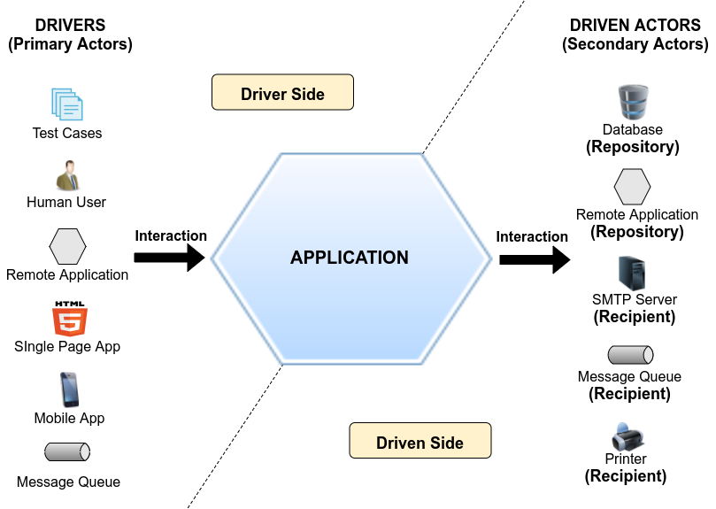
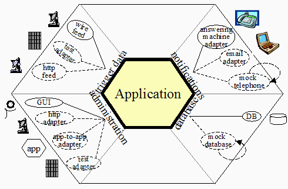
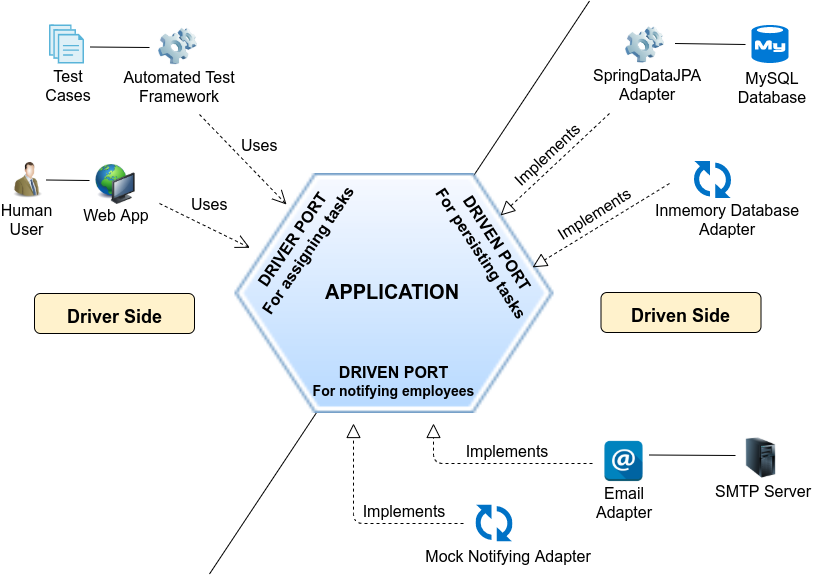

### Background

- Layered architecture segregates an application into different tiers - the most common is the 3 tier architecture where the application is split into the Presentation Layer, Logic Layer, Data Layer.

- Layered architecture's attempts to enforce a separation of concerns. But Hexagonal Architecture was introduced on the basis that there is a risk with traditional approach in highly coupling the layers as business logic will inevitably leak from one layer to the next, particularly in the presentation layer.

- Hexagonal Architecture (also known as ports and adaptors) was founded by Alistair Cockburn in 2005. Alistair argues that design issues arise when business logic is entangled with external entities. Therefore, decoupling any external actors from the application will allow it to act independently of any technology that it interfaces with it.

- Hexagonal architecture uses 'ports' to allow external entities to communicate with the application. For every input and output to the application we have a port. It's a way for the application to communicate to the outside world without needing to know what it's interacting with.

- External sources communicate to ports via an adaptor. The adaptor takes data from the port and converts it into the format required for the external source

- The port and the application don't need to change. The adaptors are used for the outside world to transform the business domain details into necessary read/write data.

- There are two sources to the application: the input and the output. Alistair describes these as the driving side and the driven side. The input is driving the application to do something where as the output is driven by the application itself.

- Inputs can be apis but so can outputs which means hexagons can talk to other hexagons! This concept encapsulates domain-driven design where each hexagon is responsible for a single domain e.g. users, search, files, emails etc.

### Breakdown of architecture:

 
 
 

### The Hexagon

- The hexagon is the application itself. We can use 'hexagon' interchangeably with application.

- The hexagon contains the business problem solutions.

### Actors

- Outside the hexagon are things the application interacts with. They can be humans, other applications or any hardware/software device. These are known as actors.

- Actors are categorized as either drivers (or primary actors) or driven (or secondary actors).

- Drivers/Primary actors trigger interactions with the application e.g. a test, a web application, a mobile app

- Driven/Secondary actors are triggered by the application to provide some functionality needed by the application e.g. databases, message queues, another application

- Driven actors can either be repositories where the application can also receive information from it or a recipient where the information is sent to it as a set and forget. Example of a repository is a database or storage device where as a recipient can be an SMTP server for sending an email, a printer, a text message to a phone etc.

### Ports

- Ports are at the application/hexagon boundary which are interfaces that the application offers to the outside world. Ports belong to the application itself.

- Driver ports are the **API** of the application. You can group the use cases into one port or spread across a few if we want to follow the Single Responsibility Principle.

- If using a lot of ports, a recommended option is applying the command bus design pattern or [[CQRS pattern |architecture#command-query-responsibility-segregation-cqrs]] a port for executing commands and another port for executing queries.

- A driven port is an interface for functionality to implement business logic. Driven ports are the **SPI** (service provider interface) required by the application.

- The purpose of ports is to shift the design by purpose instead of technology and to have technologies be substitutable on all sides by an adapter. Ports are tech agnostic - it's up to adapters to transform data according to a specific actor's technical needs needs.

### Adapters

- Actors interact with the hexagon ports through adapters using specific technology. Adapters are **outside** the application

- For any port there may be multiple adapters for each desired technology we want to use. For example, a port for notifications may have an adapter for email, text message and a phone call.

- A driver adapter uses a driver port interface, converting technology requests into a technology agonistic request to a driver port.

- For each driver port, there should be at least two adapters - one for the real driver and another for testing the behaviour of the port

- A driven adapter implements the driven port interface, converting the technology agnostic methods of the port into specific technology methods. It essentially converts one interface to another.

- We can use the [adapter design pattern](https://refactoring.guru/design-patterns/adapter/typescript/example) to implement adapters

### Other

Besides the above, there will be a 'composition root' or Main Component that runs at startup and builds the whole system. It should:

- Initialise and configure the environment
- For each port, it chooses the adapter implementing the port e.g. in-memory database vs postgres database
- creates the application and injects the driven adapters as instances to the applications constructor
- for each driver port, it chooses the driver adapter that uses the port and creates an instance of the adapter, injecting it into the applications constructor. It then runs the driver adapter instance

#### References

1. ttps://medium.com/ssense-tech/hexagonal-architecture-there-are-always-two-sides-to-every-story-bc0780ed7d9c
2. https://scalastic.io/en/hexagonal-architecture/
3. https://youtu.be/bDWApqAUjEI?feature=shared
4. https://jmgarridopaz.github.io/content/hexagonalarchitecture.html#tc2-1
5. https://web.archive.org/web/20170624023207/http://alistair.cockburn.us/Configurable+Dependency
